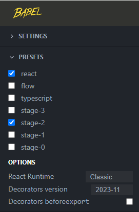
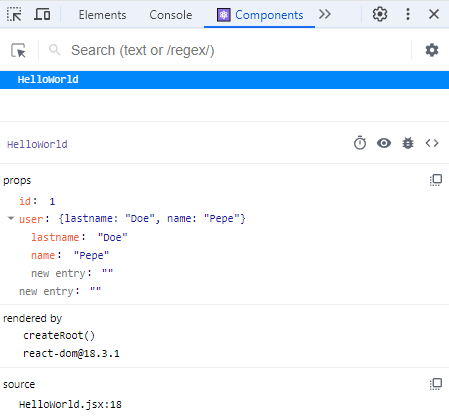
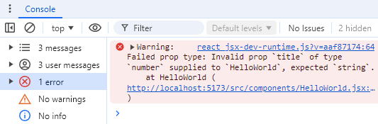
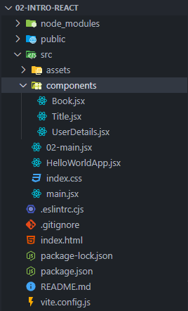

# 2-intro-react

## React

React es una biblioteca de JavaScript especializada en el desarrollo de interfaces de usuario para aplicaciones web. Aunque a veces se le denomina "framework", es más preciso llamarlo una biblioteca o librería.

## Características principales de React

- **JSX (JavaScript XML)**: Permite escribir interfaces de usuario con una sintaxis similar a HTML dentro de JavaScript, facilitando el desarrollo.

- **Virtual DOM**: Optimiza el rendimiento al actualizar solo las partes del DOM (Document Object Model) que han cambiado.

- **Componentes**: Posee una estructura basada en componentes reutilizables que encapsulan su propio estado y comportamiento.

- **Flujo de datos unidireccional**: Simplifica la depuración y el mantenimiento al hacer que los datos fluyan en una sola dirección.

- **Declarativo**: Describe cómo debería verse la interfaz en cada momento y actualiza automáticamente los componentes cuando los datos cambian.

- **Herramientas y librerías asociadas**: Incluye herramientas como React Router para la gestión de rutas y Axios para peticiones HTTP.

- **Versatilidad**: Es utilizado para desarrollar aplicaciones web, móviles (con React Native) y fullstack (con Next.js).

## Tipos de depedencias en el proyecto

- Las dependencias principales del proyecto, `react` y `react-dom`, incluyen tanto dependencias asociadas como independientes. El archivo `package.json` distingue entre dependencias de producción (`dependencies`) y dependencias de desarrollo (`devDependencies`).

- Al construir el proyecto para producción con Vite, solo las dependencias de producción se incluirán en el bundle final, optimizando así el proyecto. Vite también compila el código moderno de JavaScript (ES6+) a JavaScript nativo compatible con los navegadores.

## Manipulación del DOM en React

- React trabaja detrás del DOM, convirtiendo componentes con etiquetas HTML a JavaScript y manipulando el DOM para renderizarlos. Simplifica el trabajo con vistas y plantillas usando etiquetas HTML que se convierten en código JavaScript, formando un árbol de estructura HTML y renderizándolo en el navegador.

- JSX permite escribir código que se parece mucho a HTML, pero que se convierte en llamadas a funciones de JavaScript en tiempo de compilación. Esto facilita la creación y manipulación de componentes en React.

```js
// Codigo escrito en formato JSX
const h1 = <h1><ul><li>item 1</li></ul></h1>

ReactDOM.createRoot(document.getElementById('root')).render(
    h1
)

// La ejecución del código por detras de React
const h1 = React.createElement("h1", null,
    React.createElement("ul", null,
        React.createElement("li", null, "item 1")
    )
);

// Javascript puro, manipulando el DOM directamente
const h2 = document.createElement("h2");
h2.innerText = "Hola mundo"
document.getElementById("root").append(h2);
```

## Convertir etiquetas HTML en JSX con Babel JS

El uso de etiquetas HTML directamente en React puede parecer extraño al principio, ya que parece que se están mezclando dos lenguajes diferentes. Babel es una herramienta que permite transformar el JavaScript moderno, incluido el JSX, en un código que pueda ser interpretado por todos los navegadores.

### Pasos para convertir HTML a JSX con Babel

1. Visita [BabelJS.io](https://babeljs.io/), ve a la barra de menú y haz clic en la opción `Try it out`.

2. En la sección **Preset**, marca la opción `React` y en React runtime, elige `Classic`.



Observa el siguiente ejemplo, primero copia y pega el siguiente codigo HTML y el resultado que se obtiene es codigo JavaScript nativo.

```html
<section>
  <div>
    <ul>
      <li>1</li>
      <li>2</li>
      <li>3</li>
      <li>4</li>
      <li>5</li>
      <li>6</li>
    </ul>
  </div>
</section>
```

```js
/*#__PURE__*/React.createElement("section", null, 
/*#__PURE__*/React.createElement("div", null, 
/*#__PURE__*/React.createElement("ul", null, 
/*#__PURE__*/React.createElement("li", null, "1"), 
/*#__PURE__*/React.createElement("li", null, "2"), 
/*#__PURE__*/React.createElement("li", null, "3"), 
/*#__PURE__*/React.createElement("li", null, "4"), 
/*#__PURE__*/React.createElement("li", null, "5"), 
/*#__PURE__*/React.createElement("li", null, "6"))));
```

## Carpeta components

- Es una buena práctica organizar el proyecto en carpetas. Dentro de la carpeta raíz `src`, crea una subcarpeta llamada components para almacenar los modulos de tipo componente.

- Es importante tener en cuenta que los nombres de los archivos JSX utilizan la notación **UpperCamelCase**. Se recomienda evitar cambiar el nombre de los archivos creados para no tener inconvenientes al momento de ejecutar el proyecto.

- Por otro lado, el componente principal puede llevar el sufijo `App` y debe permanecer en la carpeta `src`, no en ninguna subcarpeta.

## Visualizar los componentes con React Developer Tools

En las herramientas de desarrollo del navegador (al pulsar F12), busca la sección Components para ver una lista de los componentes de React que están presentes en la página. En este caso, selecciona el componente `HelloWorld` para expandirlo y visualizar todas sus propiedades definidas con sus respectivos valores.



## Libreria PropTypes

- **PropTypes** es una librería esencial en React para validar y gestionar las propiedades de los componentes. Permite especificar los tipos de datos esperados para las propiedades, definir valores predeterminados y marcar ciertas propiedades como obligatorias. Esto ayuda a que las aplicaciones sean más predecibles y resistentes a errores, mejorando la robustez y claridad del código.

- La siguiente imagen, muestra un mensaje de error de que la propiedad `title` se esperaba que se reciba un dato de tipo String, pero se recibe uno de tipo number.




### Instalar la dependencia PropTypes

- Es importante tener en cuenta que Vite no incluye la libreria PropTypes por defecto, por lo cual se procede a instalarlo manualmente usando el comando `npm install prop-types` en una terminal de Visual Studio Code.

- Verifica que `prop-types` esté incluido como una dependencia en el archivo `package.json`.

## Default Props (desactualizado)

- Otra forma de manejar valores por defecto en las propiedades es mediante el uso de **defaultProps**. Esto permite establecer valores predeterminados para las propiedades en caso de que no se pasen desde el componente padre.

- Puedes utilizar React Developer Tools para visualizar las propiedades que se pasan a los componentes, incluyendo aquellas que no están definidas explícitamente en el componente padre main (valores definidos con defaultProps).

## Subcomponentes en React

- Una de las grandes ventajas de React es la capacidad de dividir un componente en subcomponentes reutilizables. Esto mejora la organización y la reutilización del código.

- En este caso se han creado tres subcomponentes que se instanciarán en el componente `HelloWorldApp` con sus respectivas propiedades: el título (`title`), los detalles del usuario (`id`, `user.name` y `user.lastname`) y el libro (`book`).

- Con la organización de componentes, la aplicación se vuelve más modular y fácil de entender. Cada componente tiene una responsabilidad clara y puede ser reutilizado en diferentes partes de la aplicación o en otros proyectos. La composición de componentes es una práctica fundamental en React que promueve un código limpio y mantenible.


