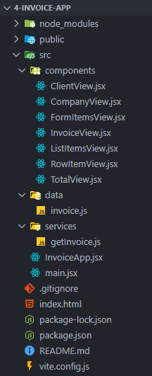

# 4-invoice-app

## Estructura de archivos y carpetas

La carpeta **`src`** organiza el código en subcarpetas y archivos específicos según su funcionalidad:

1. **`Components/`**
   
   - Contiene **componentes reutilizables** de la aplicación, generalmente definidos como funciones o clases de React.

2. **`Data/`**
   
   - Almacena archivos **`.js` con datos estáticos** que no cambian dinámicamente.

3. **`Services/`**
   
   - Contiene funciones o módulos para **manipular datos**, como operaciones CRUD (Crear, Leer, Actualizar, Eliminar).

4. **`InvoiceApp.jsx`**
   
   - El **componente principal** de la aplicación que organiza y renderiza todos los demás componentes.
   - Sirve como el punto central de la lógica y el diseño.

5. **`main.jsx`**
   
   - Es el archivo de **entrada principal** donde se inicializa la aplicación.
   - Aquí se usa `ReactDOM.render` (o `createRoot`) para renderizar el componente principal **`InvoiceApp`** dentro del DOM, generalmente en un elemento `<div id="root">`.



## Bootstrap

Bootstrap es un framework responsivo que facilita el diseño adaptable para diferentes dispositivos, ofreciendo herramientas listas para usar en **CSS3** y **JavaScript**.

### Uso del CDN de Boostrap

1. Ve a la página oficial de [Bootstrap](https://getbootstrap.com/) y selecciona la sección **"Download"**.

2. Busca el apartado **"CDN via jsDelivr"** y copia el enlace de la etiqueta `<link>` correspondiente al archivo **`bootstrap.min.css`**.

3. Abre tu archivo **`index.html`** y pega el enlace dentro de las etiquetas `<head></head>`.

Al incluir el CDN, los estilos predefinidos de Bootstrap estarán disponibles para todos los componentes en tu aplicación, aplicándose automáticamente. Esto simplifica la creación de diseños responsivos y estilizados sin necesidad de escribir CSS desde cero.

## Aplicación de estilos de Bootstrap en React

En React, se utiliza la propiedad **`className`** en lugar de **`class`** para aplicar estilos de Bootstrap. 

### Clases de tipo contenedor

- **container**: Crea un contenedor centrado con márgenes automáticos.
- **row**: Crea una fila para el sistema de cuadrícula.
- **col**: Divide las filas en columnas.

### Clases de tipo lista

- **list-group**: Estiliza listas no ordenadas como un grupo de elementos.
- **list-group-item**: Aplica estilo a cada elemento de la lista.

### Clases de tipo tabla

- **table**: Estiliza tablas HTML básicas.
- **table-striped**: Añade rayas alternadas a las filas de una tabla.
- **table-hover**: Resalta las filas al pasar el cursor sobre ellas.

### Clases de tipo card

- **card**: Crea un contenedor con bordes redondeados y sombra.
  
  - **card-header**: Estilo para el encabezado del card.
  - **card-body**: Contenido principal del card.

### Clases de márgenes y anchos

- **m-3**: Aplica un margen de 3 unidades en todos los lados.
- **my-3**: Aplica un margen vertical (arriba y abajo) de 3 unidades.
- **w-50**: Define un ancho del 50%.

### Texto y badges

- **text-end**: Alinea el texto hacia la derecha.
- **badge bg-success**: Aplica estilo de badge (etiqueta) con un fondo verde.

### Formularios y botones

- **form-control**: Aplica estilo a campos de entrada de tipo `text` de formularios.
- **btn btn-primary**: Estiliza un botón con el tema principal (color azul).
- **btn btn-secondary**: Estiliza un botón con un tema secundario (color gris).

## Listas en React

- En React, las listas se utilizan para renderizar un conjunto de elementos basados en datos dinámicos, como un arreglo. Esto se logra usando el método **`map()`**, que recorre los elementos del arreglo y devuelve un componente o elemento JSX para cada uno.

- Cada elemento en una lista debe tener un atributo `key` único para ayudar a React a identificar qué elementos han cambiado, agregado o eliminado.

- Si los datos tienen un identificador único, úsalo como clave. Si no, puedes usar el índice del elemento como última opción.

```jsx
const App = () => {
  const tasks = ["Aprender React", "Practicar Hooks", "Construir una app"];

  return (
    <div>
      <h1>Mis Tareas</h1>
      <ul>
        {tasks.map((task, index) => (
          <li key={index}>{task}</li>
        ))}
      </ul>
    </div>
  );
};

export default App;
```

## Método reduce en JavaScript

El método **`reduce`** permite transformar un arreglo en un único valor acumulando los resultados de cada elemento. Es útil para realizar operaciones como la suma, concatenación o cálculo de estadísticas.

### Sintaxis

```js
arr.reduce((accumulator, currentValue) => {
  // operación con accumulator y currentValue
}, initialValue);
```

- **`accumulator`**: El valor acumulado hasta la iteración actual.
- **`currentValue`**: El elemento actual del arreglo que se está procesando.
- **`initialValue`**: El valor inicial del acumulador (opcional).Ejemplo práctico:

```js
const products = [
  { name: "Producto 1", price: 100 },
  { name: "Producto 2", price: 200 },
  { name: "Producto 3", price: 300 },
];

// Aplica un 10% de impuesto a cada precio y genera un nuevo arreglo
const pricesWithTax = products.map((product) => product.price * 1.1);

// Utiliza reduce para sumar los precios con impuestos
const total = pricesWithTax.reduce((accumulator, currentValue) => {
  return accumulator + currentValue;
}, 0);

console.log("Precios con impuestos:", pricesWithTax); // [110, 220, 330]
console.log("Total acumulado:", total); // 660
```

## Tips y Atajos Útiles en Visual Studio Code (VSCode)

1. **Multicursor (Escribir en Múltiples Líneas Simultáneamente):**
   
   - Pulsa la tecla **ALT** (en Windows/Linux) o **OPTION** (en Mac) y haz clic en diferentes puntos del código. Esto te permite editar varias líneas al mismo tiempo.

2. **Abreviaturas de Emmet:**
   
   - Escribe abreviaturas como `div.text-end.bg-success` y presiona **Enter** para generar automáticamente un elemento HTML con clases aplicadas: `<div class="text-end bg-success"></div>`

3. **Buscar y Reemplazar Rápido:**
   
   - Usa **CTRL + H** para abrir la herramienta de búsqueda y reemplazo. Facilita renombrar elementos o cambiar cadenas en todo el archivo o proyecto.

4. **Edición Más Precisa con Atajos Adicionales:**
   
   - **CTRL + D**: Selecciona la siguiente ocurrencia del texto seleccionado.
   - **CTRL + SHIFT + L**: Selecciona todas las ocurrencias del texto seleccionado.
   - **ALT + SHIFT + Flechas**: Duplica o mueve líneas rápidamente.

## Formularios en React

Los formularios en React son un componente fundamental para capturar datos del usuario. React proporciona una forma eficiente y controlada de manejar formularios mediante el **estado** y los **eventos**.

### Elementos Controlados

- En un elemento controlado, React gestiona el valor del formulario mediante el estado del componente.
- Cada cambio en el formulario se maneja a través del evento `onChange`, actualizando el estado.

```jsx
import { useState } from 'react';

function FormExample() {
  const [inputValue, setInputValue] = useState("");

  const handleChange = (e) => {
    setInputValue(e.target.value); // Actualiza el estado con el valor del input
  };

  const handleSubmit = (e) => {
    e.preventDefault(); // Evita el envío por defecto del formulario
    console.log(inputValue); // Muestra el valor en consola
  };

  return (
    <form onSubmit={handleSubmit}>
      <input 
        type="text" 
        value={inputValue} 
        onChange={handleChange} 
        placeholder="Escribe algo" 
      />
      <button type="submit">Enviar</button>
    </form>
  );
}
```

### Manejo de Múltiples Campos

- Usa un solo estado para manejar múltiples campos de un formulario.
- Utiliza el nombre del campo (`name`) como clave para identificarlo.

```jsx
function MultiFieldForm() {
  const [formData, setFormData] = useState({ name: "", email: "" });

  const handleChange = (e) => {
    const { name, value } = e.target;
    setFormData({ ...formData, [name]: value });
  };

  const handleSubmit = (e) => {
    e.preventDefault();
    console.log(formData); // Muestra los datos en consola
  };

  return (
    <form onSubmit={handleSubmit}>
      <input 
        name="name" 
        value={formData.name} 
        onChange={handleChange} 
        placeholder="Nombre" 
      />
      <input 
        name="email" 
        value={formData.email} 
        onChange={handleChange} 
        placeholder="Correo electrónico" 
      />
      <button type="submit">Enviar</button>
    </form>
  );
}
```

### Validación de Formularios

- Puedes validar los datos antes de enviarlos, ya sea mediante funciones personalizadas o librerías externas como **Formik** o **React Hook Form**.

## UseEffect

El hook `useEffect` permite manejar efectos secundarios en componentes funcionales de React, como realizar solicitudes a servidores, suscribirse a eventos o interactuar con el DOM. Es ideal para mejorar la eficiencia al controlar cuándo se ejecutan ciertas acciones durante el ciclo de vida del componente.

### Sintaxis

`useEffect` toma dos argumentos:

- **Función de efecto:** La lógica que se ejecutará.
- **Dependencias (opcional):** Un arreglo que determina cuándo debe ejecutarse la función de efecto.

```jsx
useEffect(() => {
  // Lógica del efecto
}, [dependencias]);
```

### Dependencias

- **Sin arreglo:** El efecto se ejecuta después de cada renderizado.
- **Arreglo vacío (`[]`):** El efecto se ejecuta solo una vez, después del primer renderizado (similar a `componentDidMount` en clases).
- **Con dependencias:** El efecto se ejecuta solo cuando cambian las dependencias especificadas.

### Ventajas

- **Optimización:** Evita ejecuciones innecesarias en cada renderizado.
- **Control del ciclo de vida:** Puedes definir lógica específica para el montaje, actualización y desmontaje del componente.
- **Legibilidad:** Mejora la organización del código al separar la lógica de efectos secundarios.

### Caso de uso

- `getInvoice` se ejecuta solo al montar el componente, evitando que el servidor sea llamado en cada renderizado.
- El resultado de `getInvoice` se almacena en el estado, y los componentes hijos se renderizan solo si `invoice` tiene datos.

```jsx
import { useState, useEffect } from "react";
import { getInvoice } from "./services/getInvoice";
import { ClientView } from "./components/ClientView";
import { CompanyView } from "./components/CompanyView";
import { ListItemsView } from "./components/ListItemsView";
import { TotalView } from "./components/TotalView";

export const InvoiceApp = () => {
  const [invoice, setInvoice] = useState(null);

  // Ejecuta getInvoice solo una vez al montar el componente
  useEffect(() => {
    const data = getInvoice();
    setInvoice(data); // Almacena el resultado en el estado
    console.log(data); // Imprime los datos en la consola
  }, []); // Arreglo vacío: el efecto se ejecuta solo una vez

  return (
    <div className="container">
      {invoice && (
        <>
          <ClientView client={invoice.client} />
          <CompanyView company={invoice.company} />
          <ListItemsView items={invoice.items} />
          <TotalView total={invoice.total} />
        </>
      )}
    </div>
  );
};
```

### Limpieza

Puedes devolver una función dentro del efecto para limpiar recursos, como suscripciones o temporizadores, antes de que el componente se desmonte o el efecto vuelva a ejecutarse.

```jsx
useEffect(() => {
  const timer = setInterval(() => console.log("Tick"), 1000);

  return () => clearInterval(timer); // Limpia el temporizador
}, []);
```

## Operador ternario en JSX

El operador ternario (`condición ? expr1 : expr2`) se utiliza en JSX para renderizar contenido condicionalmente. Es una alternativa compacta a las estructuras condicionales tradicionales como `if`.

**Sintaxis general**: `condición ? <ComponenteA /> : <ComponenteB />`

- Si la condición es `true`, se renderiza `<ComponenteA />`.
- Si es `false`, se renderiza `<ComponenteB />`.

```jsx
const isLoggedIn = true;

return (
  <div>
    {isLoggedIn ? <h1>Bienvenido</h1> : <h1>Por favor, inicia sesión</h1>}
  </div>
);
```

### Forma Simplificada con `&&`

Cuando solo necesitas renderizar algo si la condición es `true`, puedes usar el operador lógico `&&`. Esto elimina la necesidad de escribir una expresión para el caso `false`.

```jsx
const showMessage = true;

return (
  <div>
    {showMessage && <h1>Mensaje mostrado</h1>}
  </div>
);
```

### **Forma Simplificada con `||`**

El operador lógico `||` se usa cuando necesitas renderizar un valor predeterminado si la condición es `false` o `undefined`.

```jsx
const userName = "";

return (
  <div>
    <h1>{userName || "Invitado"}</h1>
  </div>
);
```
