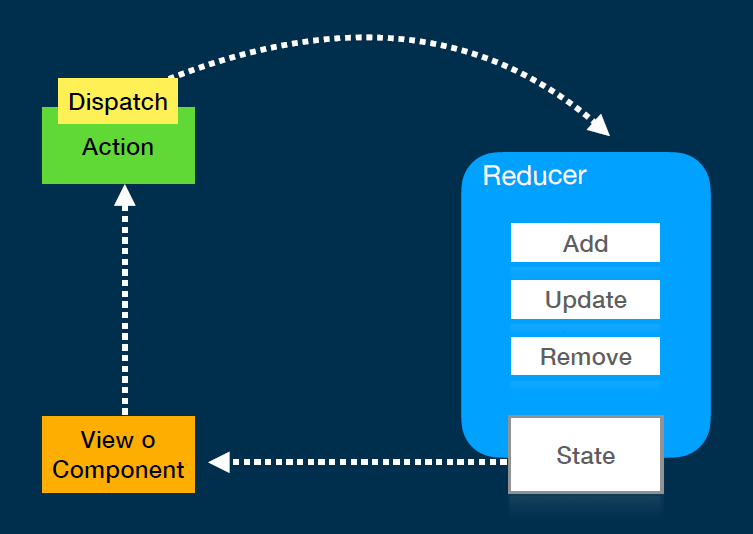

# 5-cart-app

## Método map vs filter

Es mejor usar **`map`** en lugar de **`filter`** para actualizar la cantidad de un producto porque cada uno tiene un propósito diferente y `map` es más adecuado para transformar un arreglo sin eliminar elementos.

### Map

- Recorre cada elemento del arreglo y genera un nuevo arreglo con los resultados de aplicar una función de transformación a cada elemento.
- No elimina elementos del arreglo original.
- Se usa cuando quieres **modificar** algunos (o todos) los elementos del arreglo, dejando el resto sin cambios.

```jsx
const productos = [
  { id: 1, nombre: "Manzana", cantidad: 3 },
  { id: 2, nombre: "Plátano", cantidad: 5 },
];

const idProducto = 1;
const nuevaCantidad = 10;

const productosActualizados = productos.map((producto) =>
  producto.id === idProducto
    ? { ...producto, cantidad: nuevaCantidad }
    : producto
);

console.log(productosActualizados);

/*
[
  { id: 1, nombre: "Manzana", cantidad: 10 },
  { id: 2, nombre: "Plátano", cantidad: 5 }
]
*/
```

### Filter

- Recorre cada elemento del arreglo y genera un nuevo arreglo que contiene solo los elementos que cumplen con una condición.
- Se usa cuando quieres **eliminar** elementos del arreglo original.
- No es adecuado para **modificar** elementos, ya que su propósito es filtrar elementos.

```jsx
const productosActualizados = productos.filter(
  (producto) => producto.id !== idProducto
);

/*
[
  { id: 2, nombre: "Plátano", cantidad: 5 }
]
*/
```

### Por qué `map` es más conveniente para actualizar cantidades

1. **Preserva todos los elementos del arreglo:**
   
   - `map` deja intactos los elementos que no necesitan cambios. Esto es importante porque no queremos eliminar ningún producto, solo actualizar la cantidad de uno de ellos.

2. **Específico para transformaciones:**
   
   - `map` permite aplicar una transformación a un elemento específico mientras mantiene los demás sin cambios. Es más claro y semántico para el caso de uso de actualización.

3. **Evita errores de eliminación:**
   
   - Usar `filter` accidentalmente podría eliminar productos en lugar de actualizarlos, lo cual puede ser un comportamiento no deseado.

## SessionStorage

**`sessionStorage`** es una API de almacenamiento web en JavaScript que permite guardar datos en el navegador de forma **temporal** y **local** (específico para la pestaña o ventana del navegador en uso). Los datos almacenados en `sessionStorage`:

1. **Persisten solo durante la sesión actual**: Se eliminan automáticamente cuando la pestaña o ventana del navegador se cierra.

2. **Son accesibles únicamente desde la pestaña/ventana donde fueron guardados**: No se comparten entre pestañas, incluso si pertenecen al mismo dominio.

### Características principales

- **Capacidad de almacenamiento:** Similar a `localStorage`, puede almacenar hasta unos 5MB de datos (dependiendo del navegador).
- **Almacena datos en formato clave-valor**: Las claves y valores deben ser cadenas de texto.

```jsx
// Guardar un dato
sessionStorage.setItem("nombre", "Juan");

// Obtener un dato
const nombre = sessionStorage.getItem("nombre");
console.log(nombre); // "Juan"

// Eliminar un dato
sessionStorage.removeItem("nombre");

// Limpiar todos los datos de sessionStorage
sessionStorage.clear();
```

### Diferencia con `localStorage`

- **`sessionStorage`**: Los datos se eliminan al cerrar la pestaña/ventana.
- **`localStorage`**: Los datos persisten incluso después de cerrar el navegador o reiniciar el dispositivo, hasta que se eliminen manualmente.

### Casos de uso comunes

- Almacenar datos temporales como un token de autenticación para la sesión activa.
- Guardar información de un formulario que no necesita persistir después de cerrar la pestaña.

## UseReducer

El hook **`useReducer`** es una alternativa a **`useState`** para manejar el estado en componentes de React, especialmente cuando el estado es más complejo o involucra múltiples subvalores. En lugar de modificar el estado directamente, como en `useState`, **`useReducer`** utiliza un **reductor** (una función) para manejar las actualizaciones del estado de manera más estructurada.

### ¿Cómo funciona `useReducer`?

1. **`useReducer` toma dos argumentos:**
   
   - Un **reductor** (función que define cómo actualizar el estado).
   - Un valor inicial del estado.

2. El reductor es una función que recibe el **estado actual** y una **acción**, y devuelve el nuevo estado.

### Sintaxis

```javascript
const [state, dispatch] = useReducer(reducer, initialState);
```

- `state`: El estado actual.
- `dispatch`: Función que se utiliza para enviar (disparar) acciones que cambiarán el estado.
- `reducer`: La función que define cómo cambiar el estado basado en la acción recibida.
- `initialState`: El valor inicial del estado.



### Ejemplo básico

```jsx
import React, { useReducer } from "react";

// Reductor que maneja las acciones
const counterReducer = (state, action) => {
  switch (action.type) {
    case "increment":
      return { count: state.count + 1 };
    case "decrement":
      return { count: state.count - 1 };
    default:
      return state;
  }
};

const Counter = () => {
  // Uso de useReducer con el reductor y el estado inicial
  const [state, dispatch] = useReducer(counterReducer, { count: 0 });

  return (
    <div>
      <p>Count: {state.count}</p>
      <button onClick={() => dispatch({ type: "increment" })}>Increment</button>
      <button onClick={() => dispatch({ type: "decrement" })}>Decrement</button>
    </div>
  );
};

export default Counter;
```

### ¿Cuándo usar `useReducer`?

- **Estados complejos**: Si el estado tiene muchas propiedades o depende de varias condiciones.
- **Manejo de acciones**: Si las actualizaciones de estado dependen de múltiples acciones.
- **Alternativa a `useState`**: Si el uso de `useState` se vuelve difícil de manejar debido a actualizaciones complejas o interdependientes.

### Ventajas sobre `useState`

- Mejora la organización cuando se tienen muchos valores de estado o acciones relacionadas.
- Es útil en escenarios donde el estado depende de acciones complejas o múltiples actualizaciones.

## ¿Como pasar de useState a useReducer?

Para convertir el uso de `useState` a `useReducer` en un caso de carrito de compras, primero debemos entender cómo se maneja el estado en el carrito. Por lo general, el estado de un carrito de compras incluye información sobre los productos, como el id, la cantidad y el precio total.

Para convertir el uso de `useState` a `useReducer` en un caso de carrito de compras, primero debemos entender cómo se maneja el estado en el carrito. Por lo general, el estado de un carrito de compras incluye información sobre los productos, como el id, la cantidad y el precio total.

### Paso 1: Usando `useState` en un carrito de compras

Cuando usamos `useState`, podríamos tener algo como esto:

```jsx
import React, { useState } from "react";

const ShoppingCart = () => {
  const [cart, setCart] = useState([]);

  const addProduct = (product) => {
    setCart((prevCart) => [...prevCart, product]);
  };

  const removeProduct = (productId) => {
    setCart((prevCart) => prevCart.filter((item) => item.id !== productId));
  };

  return (
    <div>
      <button onClick={() => addProduct({ id: 1, name: "Product 1", price: 100 })}>
        Add Product 1
      </button>
      <button onClick={() => removeProduct(1)}>Remove Product 1</button>
      <div>
        <h3>Shopping Cart</h3>
        {cart.map((product) => (
          <div key={product.id}>
            <p>{product.name} - ${product.price}</p>
          </div>
        ))}
      </div>
    </div>
  );
};

export default ShoppingCart;
```

### Paso 2: Convertir a `useReducer`

Usaremos `useReducer` para manejar el estado de una manera más estructurada. El reductor tendrá acciones para agregar, eliminar y actualizar la cantidad de productos.

#### 1. Definir el reductor

Primero definimos un reductor que describe cómo el estado debe cambiar en función de las acciones que se despachan.

```javascript
const cartReducer = (state, action) => {
  switch (action.type) {
    case "ADD_PRODUCT":
      return [...state, {...action.product, quantity: 1 }];
    case "REMOVE_PRODUCT":
      return state.filter((product) => product.id !== action.productId);
    case "UPDATE_QUANTITY":
      return state.map((product) =>
        product.id === action.productId
          ? { ...product, quantity: action.quantity }
          : product
      );
    default:
      return state;
  }
};
```

#### 2. Configurar `useReducer`

Ahora, configuramos `useReducer` en el componente para manejar las acciones.

```jsx
import React, { useReducer } from "react";
import { cartReducer } from "../reducer"

const ShoppingCart = () => {
  // Usamos useReducer en lugar de useState
  const [cart, dispatch] = useReducer(cartReducer, []);

  // Agregar producto al carrito
  const addProduct = (product) => {
    dispatch({ type: "ADD_PRODUCT", product });
  };

  // Eliminar producto del carrito
  const removeProduct = (productId) => {
    dispatch({ type: "REMOVE_PRODUCT", productId });
  };

  // Actualizar la cantidad de un producto
  const updateQuantity = (productId, quantity) => {
    dispatch({ type: "UPDATE_QUANTITY", productId, quantity });
  };

  return (
    <div>
      <button onClick={() => addProduct({ id: 1, name: "Product 1", price: 100 })}>
        Add Product 1
      </button>
      <button onClick={() => removeProduct(1)}>Remove Product 1</button>
      <button onClick={() => updateQuantity(1, 3)}>Update Quantity of Product 1</button>

      <div>
        <h3>Shopping Cart</h3>
        {cart.map((product) => (
          <div key={product.id}>
            <p>{product.name} - ${product.price} x {product.quantity}</p>
          </div>
        ))}
      </div>
    </div>
  );
};

export default ShoppingCart;
```

### Explicación de la conversión

1. **Estado Inicial**:
   
   - En `useState`, el estado era un array vacío `[]`. En `useReducer`, el estado inicial también es un array vacío.

2. **Acciones**:
   
   - Usamos **acciones** (`{ type: "ADD_PRODUCT", product }`) para modificar el estado. Cada acción contiene un `type` que define qué se debe hacer, y algunos datos adicionales si es necesario (por ejemplo, `product` o `productId`).

3. **Reductor**:
   
   - El **reductor** define cómo cambia el estado basado en el tipo de acción. Cuando se recibe una acción `ADD_PRODUCT`, se agrega un nuevo producto al carrito, y cuando se recibe `REMOVE_PRODUCT`, se elimina un producto.

4. **Despacho de acciones**:
   
   - En lugar de usar `setCart` como en `useState`, usamos `dispatch` para enviar las acciones al reductor. El reductor luego actualiza el estado según las acciones despachadas.

### Ventajas de usar `useReducer`:

- **Mayor control y organización**: Si el carrito tiene lógica más compleja (como actualizar cantidades, aplicar descuentos, etc.), `useReducer` organiza mejor las acciones y mantiene el código limpio y predecible.
- **Eficiencia**: El uso de un reductor facilita agregar nuevas acciones sin tener que preocuparse por cómo se organiza el estado.
- **Escalabilidad**: Si el estado del carrito se vuelve más complejo (con varios productos y acciones adicionales), `useReducer` puede manejar estos cambios de forma más estructurada que `useState`.

## Hook personalizado en React

Un **hook personalizado** en React es una función de JavaScript que permite reutilizar lógica de estado y efectos entre componentes. Los hooks personalizados se construyen utilizando hooks estándar de React como `useState`, `useEffect`, `useReducer`, etc., pero encapsulando esa lógica en una función para que sea reutilizable.

### ¿Por qué usar hooks personalizados?

- **Reutilización de lógica**: Los hooks personalizados permiten que la lógica de un componente se reutilice en otros componentes sin duplicar código.
- **Mejor organización**: Ayuda a separar y organizar la lógica relacionada con el estado o efectos en partes más pequeñas y manejables.
- **Facilidad de mantenimiento**: Al tener la lógica del estado encapsulada en un hook, el mantenimiento y las actualizaciones del código son más fáciles.

### Ejemplo de un Hook Personalizado: `useLocalStorage`

Supongamos que queremos crear un hook que se encargue de leer y escribir datos en el `localStorage`. Esto es útil, por ejemplo, para mantener la persistencia de un estado entre sesiones.

#### **1. Crear el hook personalizado**: `useLocalStorage`

```javascript
import { useState } from "react";

// Hook personalizado para manejar el localStorage
const useLocalStorage = (key, initialValue) => {
  // Leer el valor inicial desde localStorage
  const storedValue = localStorage.getItem(key);

  // Si el valor ya está en localStorage, usarlo; si no, usar el valor inicial
  const initial = storedValue ? JSON.parse(storedValue) : initialValue;

  // Estado local para manejar el valor
  const [storedValueState, setStoredValue] = useState(initial);

  // Función para actualizar el valor y guardarlo en localStorage
  const setValue = (value) => {
    // Si el valor es una función, ejecutarla con el valor actual
    const valueToStore = value instanceof Function ? value(storedValueState) : value;

    // Guardar en el localStorage
    localStorage.setItem(key, JSON.stringify(valueToStore));

    // Actualizar el estado
    setStoredValue(valueToStore);
  };

  return { storedValueState, setValue };
};

export default useLocalStorage;
```

#### 2. Usar el hook en un componente:

Ahora que tenemos el hook personalizado, podemos usarlo dentro de cualquier componente para manejar el estado persistente.

```jsx
import React from "react";
import useLocalStorage from "./useLocalStorage";

const App = () => {
  // Usamos el hook personalizado para manejar un contador en el localStorage
  const { count, setCount } = useLocalStorage("count", 0);

  const increment = () => {
    setCount(count + 1);
  };

  const decrement = () => {
    setCount(count - 1);
  };

  return (
    <div>
      <h1>Contador: {count}</h1>
      <button onClick={increment}>Incrementar</button>
      <button onClick={decrement}>Decrementar</button>
    </div>
  );
};

export default App;
```

### Explicación

1. **`useLocalStorage`**:
   
   - **Recibe**: Una clave (`key`) para identificar el valor en el `localStorage` y un valor inicial (`initialValue`).
   - **Devuelve**: Un objeto que contiene el valor almacenado en `localStorage` y una función para actualizar ese valor.

2. **Cómo funciona**:
   
   - Al iniciar, el hook verifica si hay un valor previamente guardado en el `localStorage` con la clave especificada. Si existe, lo utiliza como valor inicial; si no, usa el valor por defecto que se pasa como argumento.
   - Al llamar a `setValue`, el hook actualiza tanto el estado local como el valor guardado en el `localStorage`.

### Ventajas de los hooks personalizados

- **Reutilización de lógica**: Puedes usar el hook `useLocalStorage` en diferentes componentes, lo que elimina la duplicación de la lógica.
- **Encapsulamiento**: La lógica relacionada con el manejo del `localStorage` está completamente encapsulada en el hook, lo que facilita su uso y mantenimiento.
- **Flexibilidad**: Puedes crear hooks personalizados para manejar cualquier tipo de lógica, como formularios, validaciones, o incluso la integración con APIs.

## Barra de navegación con Boostrap

En Bootstrap, la barra de navegación (navbar) es un componente que permite crear menús de navegación de forma rápida y sencilla. Utiliza clases de Bootstrap para hacer que la barra sea responsiva, es decir, que se adapte a diferentes tamaños de pantalla, y soporta diversas opciones como enlaces, formularios, botones, etc.

### Clases clave de Bootstrap para la barra de navegación

- **`navbar`**: Clase base para la barra de navegación.
- **`navbar-expand-lg`**: Hace que la barra de navegación se expanda en pantallas grandes y se colapse en pantallas pequeñas.
- **`navbar-light` y `navbar-dark`**: Controlan el color del texto y los elementos dentro de la barra. `bg-light` y `bg-dark` controlan el color de fondo.
- **`navbar-nav`**: Se utiliza para agrupar los elementos de navegación.
- **`nav-item` y `nav-link`**: Son las clases utilizadas para los elementos individuales de la barra de navegación.

```html
<nav class="navbar navbar-expand-lg bg-body-tertiary bg-dark navbar-dark">
  <div class="container-fluid">
    <a class="navbar-brand" href="#">Navbar</a>
    <button class="navbar-toggler" type="button" data-bs-toggle="collapse" 
            data-bs-target="#navbarNav" aria-controls="navbarNav" aria-expanded="false" 
            aria-label="Toggle navigation">
      <span class="navbar-toggler-icon"></span>
    </button>
    <div class="collapse navbar-collapse" id="navbarNav">
      <ul class="navbar-nav">
        <li class="nav-item">
          <a class="nav-link active" aria-current="page" href="#">Home</a>
        </li>
        <li class="nav-item">
          <a class="nav-link" href="#">Features</a>
        </li>
        <li class="nav-item">
          <a class="nav-link" href="#">Pricing</a>
        </li>
        <li class="nav-item">
          <a class="nav-link disabled" aria-disabled="true">Disabled</a>
        </li>
      </ul>
    </div>
  </div>
</nav>
```

## React Router

**React Router** es una librería estándar para gestionar el enrutamiento en aplicaciones React. Permite definir diferentes rutas en tu aplicación y asociarlas con componentes específicos para que la interfaz cambie según la URL.

Se instala la dependencia con el comando `npm install react-router-dom`

### Características principales de React Router

1. **Enrutamiento Declarativo**: Las rutas se definen de manera declarativa utilizando JSX, lo que hace que sea fácil de entender y modificar.
2. **Navegación sin recargar la página**: React Router permite cambiar de vistas dentro de una aplicación sin recargar la página completa, lo que proporciona una experiencia similar a una SPA (Single Page Application).
3. **Rutas anidadas**: Puedes definir rutas dentro de otras rutas, permitiendo crear vistas complejas y jerárquicas.
4. **Parámetros en las rutas**: React Router permite pasar parámetros dentro de la URL que luego pueden ser utilizados dentro de los componentes.
5. **Redirección y rutas protegidas**: Puedes redirigir a los usuarios a diferentes rutas y proteger algunas rutas mediante autenticación.

### Componentes principales

1. **`<BrowserRouter>`**: Es el contenedor principal que maneja el enrutamiento y mantiene el historial de navegación. Generalmente se coloca en la parte superior de la aplicación.
2. **`<Route>`**: Define una ruta específica. Puedes asociarla a un componente que se renderiza cuando la URL coincida con el path de la ruta.
3. **`<Link>`**: Se utiliza para navegar entre rutas sin recargar la página. Reemplaza a las etiquetas `<a>` tradicionales en aplicaciones SPA.
4. **`<Switch>`**: Asegura que solo una ruta se renderice a la vez. Se coloca dentro de `<BrowserRouter>` y contiene varias rutas.

```jsx
import React from 'react';
import { BrowserRouter as Router, Route, Link, Switch } from 'react-router-dom';

// Componentes
const Home = () => <h2>Home</h2>;
const About = () => <h2>About</h2>;
const NotFound = () => <h2>Page Not Found</h2>;

const App = () => {
  return (
    <Router>
      <div>
        <nav>
          <ul>
            <li><Link to="/">Home</Link></li>
            <li><Link to="/about">About</Link></li>
          </ul>
        </nav>

        <Switch>
          <Route path="/" exact component={Home} />
          <Route path="/about" component={About} />
          <Route component={NotFound} />
        </Switch>
      </div>
    </Router>
  );
};

export default App;
```

## Introducción al arbol de componentes

En una aplicación React, el **árbol de componentes** es una representación jerárquica de los componentes de la aplicación, donde cada componente puede contener otros componentes como hijos. Los componentes se organizan y comunican a través de **props** (propiedades) y **estado**. React permite gestionar esta estructura a través de hooks como `useState`, `useReducer` y `useContext`, además de herramientas de enrutamiento como `React Router` para navegar entre diferentes vistas.
