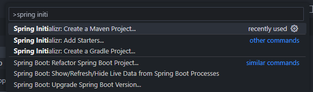
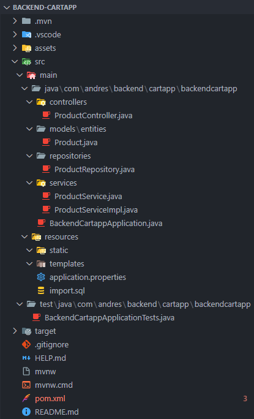
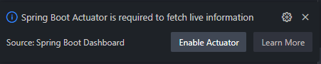
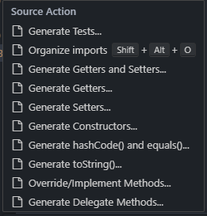
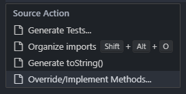
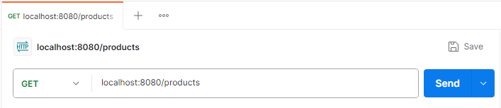
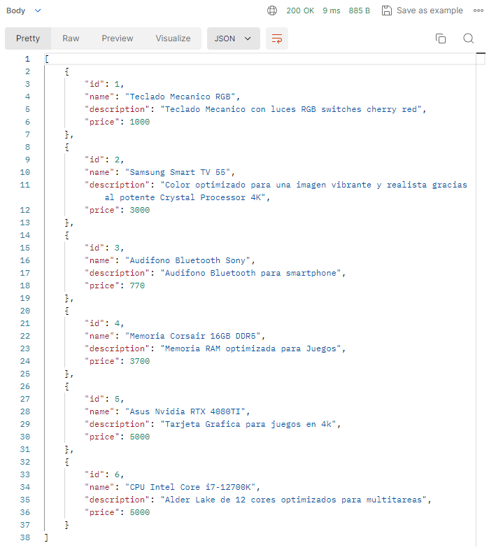
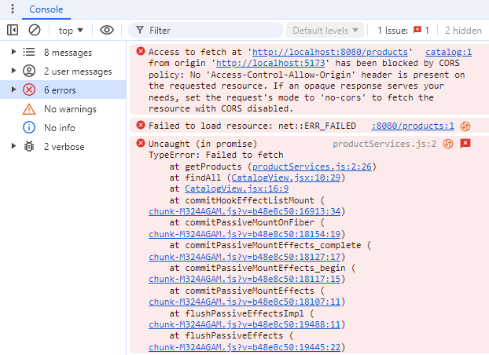

# backend-cartapp

### Extensiones de VSCode para trabajar con Spring Boot

Para trabajar eficientemente con **Spring Boot** en Visual Studio Code, se recomiendan las siguientes extensiones:

1. Spring Boot Extension Pack

2. Extension Pack for Java

3. Spring Boot Dashboard

**Requisito adicional**: Tener instalado **JDK 17 o superior** para compatibilidad con las versiones modernas de Spring Boot.

## Spring Boot

Spring Boot es una plataforma que simplifica el desarrollo de aplicaciones basadas en el **Spring Framework**. Proporciona una manera rápida, eficiente y segura de crear aplicaciones, eliminando gran parte de la configuración manual requerida en Spring tradicional.

### Caracteristicas

1. **Desarrollo Rápido y Sencillo**
   
   - Permite crear aplicaciones web con arquitecturas **RESTful** o **MVC**.
   - Soporta vistas basadas en **JSP** o **Thymeleaf**, y puede integrarse con frontends modernos como **React** o **Angular**.

2. **Servidor Embebido**
   
   - Incluye servidores como **Tomcat 10**, eliminando la necesidad de configurarlos externamente.
   - Facilita el despliegue, ya que el servidor está integrado directamente en la aplicación.

3. **Manejo Simplificado de Dependencias**
   
   - Usa **Maven** o **Gradle** para gestionar dependencias.
   - Configura automáticamente las versiones de las librerías necesarias.

4. **Autoconfiguración**
   
   - Reduce la configuración manual con anotaciones como `@SpringBootApplication`, que habilitan funcionalidades automáticamente.

5. **Herramientas para el Desarrollo**
   
   - Incluye **DevTools** para un desarrollo fluido con **Live Reload**, permitiendo ver cambios en tiempo real sin reiniciar manualmente el servidor.

6. **Monitoreo y Métricas**
   
   - Proporciona herramientas de monitoreo con **Spring Boot Actuator**, permitiendo supervisar la salud y el rendimiento de la aplicación.

7. **Despliegue Simplificado**
   
   - Genera archivos **JAR ejecutables**, que pueden ejecutarse con `java -jar nombre_del_archivo.jar`.
   - Elimina la necesidad de WAR y configuración adicional de servidores.

8. **Integración con Tecnologías Modernas**
   
   - **Spring Data**: Para bases de datos relacionales (JPA) y NoSQL (MongoDB).
   - **Spring Security**: Para autenticación, autorización y uso de **JWT**.
   - **Microservicios**: Permite construir aplicaciones distribuidas.
   - **WebFlux**: Soporte para aplicaciones reactivas.

9. **Inyección de Dependencias**
   
   - Facilita la separación de responsabilidades mediante el uso de anotaciones como `@Autowired`, `@Service`, `@Repository` y `@Controller`.

### Beneficios de Usar Spring Boot

- **Productividad**: Configuración automática y rápida curva de aprendizaje.
- **Escalabilidad**: Compatible con arquitecturas monolíticas y de microservicios.
- **Preparado para Producción**: Soporte nativo para auditoría, métricas y despliegue sencillo.
- **Flexibilidad**: Se adapta a múltiples casos de uso, desde pequeñas aplicaciones hasta soluciones empresariales complejas.

## Pasos para crear un proyecto con Spring Initializr en VSCode

1. **Abrir VSCode**
   
   - En la pestaña **Explorer**, haz clic en el botón **Create Java Project**, o busca la opción **Show and Run Commands** (`Ctrl+Shift+P`) y selecciona **Spring Initializr: Create a Maven Project...**.
   
   

2. **Configurar el Proyecto**
   
   - Selecciona **Spring Boot** como plataforma y **Maven Project** como sistema de construcción. Pulsa `Enter` después de cada selección.
   - Elige la versión estable más reciente de Spring Boot (como **3.x.x**). Evita versiones **SnapShot** o **M1** (de prueba).
   - Define **Java** como lenguaje de programación.

3. **Datos del Proyecto**
   
   - Ingresa los siguientes valores:
     - **Group ID**: Representa el nombre del paquete (ejemplo: `com.andres.backend.cartapp`).
     - **Artifact ID**: Representa el nombre de la aplicación (ejemplo: `backend-cartapp`).
   - Selecciona el empaquetado **JAR** (ideal para Spring Boot con Tomcat embebido).
   - Escoge **Java 17 o superior**.

4. **Agregar Dependencias**
   
   Incluye las siguientes dependencias para el proyecto:
   
   - **Spring Web**: Para crear APIs RESTful y controladores MVC.
   - **Spring Data JPA**: Para el manejo de bases de datos con JPA.
   - **MySQL Driver**: Conector para bases de datos MySQL.
   - **Spring Boot DevTools**: Para habilitar el reinicio automático del servidor al realizar cambios.

5. **Finalizar la Configuración**
   
   - Elige una carpeta donde se creará el proyecto.

### Estructura del Proyecto

- **`pom.xml`**: Archivo principal de configuración del proyecto Maven, donde se definen:
  
  - Versión de Spring Boot.
  - **Group ID** y **Artifact ID**.
  - Dependencias incluidas.
  - Configuración de la versión de Java.

- **`src/main/java`**: Contiene el código fuente principal de la aplicación en Java.
  
  - **`models/entities`**: Capa de entidades.
  - **`repositories`**: Capa de acceso a datos.
  - **`services`**: Capa de servicios.
  - **`controllers`**: Capa de controladores.

- **`src/main/resources`**: Archivos de configuración y recursos:
  
  - **`application.properties`**: Archivo de configuración para la aplicación.
  - **`import.sql`**: Script de SQL para insertar datos iniciales.
  - **`templates`**: Plantillas HTML (usado con **Thymeleaf** en aplicaciones monolíticas).
  - **`static`**: Archivos estáticos como CSS, JavaScript, e imágenes.

- `mvn/wrapper`: Archivos necesarios para usar Maven Wrapper sin instalación global de Maven.



## Clase Principal del Proyecto (`BackendCartappApplication.java`)

- Se encuentra dentro del paquete definido por el **Group ID** y sirve como punto de entrada de la aplicación.
- Posee una anotación: `@SpringBootApplication`, que:
  - Habilita la auto-configuración.
  - Escanea automáticamente los componentes del proyecto.
  - Configura dependencias necesarias.

## Cómo Ejecutar la Aplicación

1. Abre el menú de **Spring Boot Dashboard** en VSCode.
2. Selecciona el proyecto y haz clic en el botón **Run**.
3. Si aparece un cuadro de diálogo para habilitar **Actuator**, haz clic en **Enable Actuator** para acceder a métricas y herramientas de administración.



4. Para detener la aplicación haz clic en el botón **Stop**.

## Creación del paquete y clase

- Todas las clases deben estar dentro del paquete raíz definido en la clase principal. Por ejemplo:
  
  - **Paquete**: `com.andres.backend.cartapp.models.entities`
  - **Clase**: `Product`

- En **Java Projects**, haz clic derecho sobre el paquete raíz (`com.andres.backend.cartapp`), selecciona **New > Package** y crea `models.entities`.

- Haz clic derecho en `models.entities`, selecciona **New > Class** y nombra la clase como `Product`.

## Clase entidad

- Anota la clase con `@Entity` para marcarla como una entidad JPA. Usa `@Table(name = "products")` si el nombre de la tabla difiere del nombre de la clase.

- Usa `@Id` para identificar el campo como llave primaria. Añade `@GeneratedValue(strategy = GenerationType.IDENTITY)` para generar claves primarias automáticamente en MySQL.

- Cada campo representa una columna en la tabla. Usa `@Column` para configurar propiedades como unicidad (`unique = true`) si es necesario.

- En VSCode, haz clic derecho dentro de la clase y selecciona: **Source Action > Generate Getters and Setters**, marca todos los campos y confirma para crear los getters y setters de forma automatica.



```java
package com.andres.backend.cartapp.models.entities;

import jakarta.persistence.*;

@Entity
@Table(name = "products")
public class Product {

    @Id
    @GeneratedValue(strategy = GenerationType.IDENTITY)
    private Long id;

    @Column(unique = true, nullable = false)
    private String name;

    private Double price;
    private Integer stock;

    // Getters y Setters
    public Long getId() {
        return id;
    }

    public void setId(Long id) {
        this.id = id;
    }

    public String getName() {
        return name;
    }

    public void setName(String name) {
        this.name = name;
    }

    public Double getPrice() {
        return price;
    }

    public void setPrice(Double price) {
        this.price = price;
    }

    public Integer getStock() {
        return stock;
    }

    public void setStock(Integer stock) {
        this.stock = stock;
    }
}
```

## Introducción a los Repositorios en Spring Data JPA

Spring Data JPA simplifica el acceso a datos mediante la implementación de DAO (Data Access Object) usando interfaces y anotaciones. Los repositorios proporcionan métodos predefinidos para realizar operaciones CRUD y permiten consultas personalizadas.

### `CrudRepository`

`CrudRepository` es una interfaz genérica que incluye métodos básicos para CRUD en una entidad. Algunos métodos clave son:

- **`<S extends T> S save(S entity)`**: Guarda o actualiza una entidad.
- **`Optional<T> findById(ID id)`**: Busca una entidad por su ID.
- **`Iterable<T> findAll()`**: Obtiene todas las entidades.
- **`long count()`**: Cuenta el total de entidades.
- **`void delete(T entity)`**: Elimina una entidad.
- **`boolean existsById(ID id)`**: Verifica si una entidad existe por su ID.

### Crear un repositorio

Extiende `CrudRepository` y define la entidad y el tipo de su ID.  Al extender `CrudRepository`, se habilitan métodos CRUD sin necesidad de implementarlos.

```java
public interface ProductRepository extends CrudRepository<Product, Long> {
}
```

### Personalización de consultas

1. **Consultas Basadas en Nombres de Métodos** 
   
   Define métodos siguiendo una convención de nombres que Spring traduce automáticamente a consultas JPQL.
   
   **Ejemplo**:
   
   `List<User> findByEmailAddressAndLastname(String emailAddress, String lastname);`
   
   JPQL generado:
   
   `select u from User u where u.emailAddress = ?1 and u.lastname = ?2`

2. **Consultas Personalizadas con `@Query`**
   
   Usa `@Query` para definir consultas JPQL directamente en el método.
   
   **Ejemplo**
   
   `@Query("select u from User u where u.emailAddress = ?1") User findByEmailAddress(String emailAddress);`

### Registro Automático de Componentes

- Spring registra automáticamente componentes como repositorios (`CrudRepository`), por lo que no es necesario anotarlos con `@Repository`.
- Los componentes como servicios, repositorios y controladores pueden observarse en el menú **Spring Dashboard**.

## Servicios en Spring Boot

Los servicios en Spring Boot encapsulan la lógica de negocio y trabajan con repositorios para acceder a datos.

### Creación de la interfaz

- Dentro del paquete `services`, crea la interfaz `ProductService` que actuará como un contrato. Define métodos abstractos, como `findAll`.

```java
public interface ProductService {
    List<Product> findAll();
}
```

### Implementación del servicio

- Crea la clase `ProductServiceImpl` en el paquete `services` e implementa la interfaz `ProductService`. Para generar automáticamente la implementación del método `findAll`, haz clic derecho en el código y selecciona `Source Action...` > `Override/Implement Methods...`.



- **`@Service`**: Marca la clase como un componente de servicio para que Spring la registre automáticamente.
- **`@Autowired`**: Inyecta automáticamente el repositorio `ProductRepository` para acceder a la base de datos.
- **`@Transactional(readOnly = true)`**: Optimiza el rendimiento al configurar el método como solo lectura, sincronizándose con la base de datos en consultas.
- Como el método `findAll` de `CrudRepository` devuelve un `Iterable`, se convierte explícitamente a una `List` para facilitar el manejo de datos.

```java
@Service
public class ProductServiceImpl implements ProductService {
    @Autowired
    private ProductRepository productRepository;

    @Override
    @Transactional(readOnly = true)
    public List<Product> findAll() {
        return (List<Product>) productRepository.findAll();
    }
}
```

### **Roles de un Servicio**

- Coordina múltiples repositorios dentro de una única transacción.
- Aplica la lógica de negocio sobre los datos.
- Realiza cálculos y procesos antes de guardar o consultar datos en la base de datos.

## Implementación de un `RestController`

- `@RestController`, combina `@Controller` y `@ResponseBody`, permitiendo que los métodos devuelvan datos en formato JSON.

- Usa `@GetMapping` para mapear una ruta a un método específico.

- El método `list` utiliza el servicio para obtener todos los productos y devuelve la lista en formato JSON.

- Puedes usar `@RequestMapping("/api")` para definir una ruta base y combinarla con otras anotaciones como `@GetMapping("/products")`.

```java
@RestController
public class ProductController {

    @Autowired
    private ProductService service;

    @GetMapping("/products")
    public List<Product> list() {
        return service.findAll();
    }
}
```

## Configuración de `application.properties` en Spring Boot

El archivo `application.properties` permite configurar la conexión a la base de datos, personalizar las propiedades de la aplicación y optimizar la ejecución de JPA. Asegúrate de validar los parámetros antes de ejecutar la aplicación para evitar errores comunes de conexión o configuración.

```properties
# Nombre de la aplicación
spring.application.name=backend-cartapp

# URL de conexión
spring.datasource.url=jdbc:mysql://localhost:3306/db_Cart_springboot

# Credenciales
spring.datasource.username=root
spring.datasource.password=1234

# Driver JDBC
spring.datasource.driver-class-name=com.mysql.cj.jdbc.Driver

# Dialecto de Hibernate
spring.jpa.database-platform=org.hibernate.dialect.MySQLDialect

# Mostrar consultas SQL en los logs
spring.jpa.show-sql=true
logging.level.org.hibernate.SQL=debug
```

## Configuración de Conexión a MySQL con Spring Boot

### Crear base de datos y tabla

1. Usa **MySQL Workbench** para:
   
   - Conectar al servidor MySQL (El nombre del usuario y la contraseña deben ser el mismo que se tiene en `application.properties`)
   
   - Crear un nuevo esquema con el nombre `db_cart_springboot`. Para aquello haz clic en el botón **New Schema** y crea el nuevo esquema (base de datos).

2. En el archivo `application.properties`, añade la siguiente configuración `spring.jpa.hibernate.ddl-auto=create` para que Spring Boot cree automáticamente la tabla `products` basada en la clase `Product`.

```java
@Entity
@Table(name = "products")
public class Product {
    @Id
    @GeneratedValue(strategy = GenerationType.IDENTITY)
    private Long id;
    private String name;
    private String description;
    private Long price;
}
```

### Insertar datos de ejemplo

- **Opción 1**: Ejecuta este script SQL en MySQL Workbench:

```sql
INSERT INTO products (name, description, price) VALUES 
('Teclado Mecanico RGB', 'Teclado con luces RGB', 1000),
('Samsung Smart TV 55', 'Televisor 4K HDR', 3000),
('Audifono Bluetooth Sony', 'Audífonos inalámbricos', 770),
('Memoria Corsair 16GB DDR5', 'RAM para gaming', 3700),
('Asus Nvidia RTX 4080TI', 'Tarjeta gráfica 4K', 5000),
('CPU Intel Core i7-12700K', 'Procesador multitarea', 5000);
```

- **Opción 2**: Crea un archivo `import.sql` en `src/main/resources` con el mismo contenido. Los datos se insertaran automaticamente solamente si se tiene la configuración `spring.jpa.hibernate.ddl-auto=create`

### Ajustes para Producción

- Cambia `spring.jpa.hibernate.ddl-auto` a `update` para evitar eliminar datos al reiniciar la aplicación.

- Verifica los datos en MySQL Workbench con: `SELECT * FROM products;`

- Usa **Postman** para enviar una petición **GET** a `localhost:8080/products` y confirmar que el backend devuelve los datos en formato JSON.





Este flujo asegura una configuración básica de Spring Boot con MySQL, facilitando el desarrollo y permitiendo ajustes en entornos de producción.

## Configuración de CORS en el backend

El error relacionado con CORS (Cross-Origin Resource Sharing) ocurre cuando un cliente intenta acceder a recursos de un servidor que se encuentra en un dominio o puerto diferente. Este control de acceso está diseñado como una medida de seguridad del navegador para proteger los recursos del servidor.



Spring Boot proporciona la anotación `@CrossOrigin`, que se utiliza para habilitar solicitudes de recursos desde dominios o puertos diferentes. Puedes agregar esta anotación en los controladores o métodos específicos.

- **`origins`**: Define el dominio del cliente permitido (en este caso, `http://localhost:3000` para React en desarrollo).

```java
import org.springframework.web.bind.annotation.CrossOrigin;
import org.springframework.web.bind.annotation.GetMapping;
import org.springframework.web.bind.annotation.RestController;

@RestController
@CrossOrigin(origins = "http://localhost:3000") // Especifica la URL del cliente (React)
public class ProductController {

    @GetMapping("/products")
    public List<Product> getAllProducts() {
        // Lógica para obtener la lista de productos
        return productService.findAll();
    }
}
```

### Recomendaciones

- En **entornos de producción**, asegúrate de limitar los dominios permitidos en `allowedOrigins` para evitar accesos no deseados.
- Evita usar configuraciones demasiado permisivas (como `allowedOrigins("*")`) a menos que sea estrictamente necesario.
