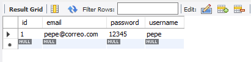
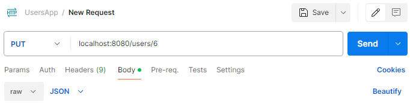
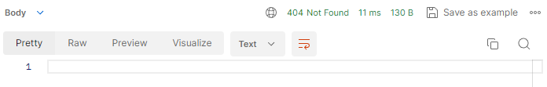

# backend-usersapp

### **Métodos CRUD Automáticos en Spring Data JPA**

Spring Data JPA simplifica enormemente las operaciones CRUD al proporcionar métodos predefinidos que no requieren implementación manual. Estos métodos están disponibles al extender la interfaz `CrudRepository` o sus derivados como `JpaRepository`.

### Ejemplo:

Se tiene la siguiente entidad

```java
import jakarta.persistence.Entity;
import jakarta.persistence.GeneratedValue;
import jakarta.persistence.GenerationType;
import jakarta.persistence.Id;
import jakarta.persistence.Column;

@Entity
public class User {

    @Id
    @GeneratedValue(strategy = GenerationType.IDENTITY)
    private Long id;

    // Garantiza que el campo username sea único en la base de datos
    @Column(unique = true) 
    private String username;

    private String email;
    private String password;

    // Getters y setters
}
```

A continuación, defines un repositorio para manejar las operaciones relacionadas con `User`:

```java
import org.springframework.data.repository.CrudRepository;

public interface UserRepository extends CrudRepository<User, Long> {
    // Puedes agregar métodos personalizados si lo necesitas
    User findByUsername(String username);
}

```

### Métodos CRUD Automáticos Disponibles

Al extender `CrudRepository`, obtienes los siguientes métodos listos para usar:

- **`save(S entity)`**: Guarda una nueva entidad o actualiza una existente.

- **`findById(ID id)`**: Encuentra una entidad por su ID.

- **`findAll()`**: Obtiene una lista de todas las entidades en la tabla.

- **`deleteById(ID id)`**: Elimina una entidad por su ID.

### La "Magia" de JPA y Hibernate

Spring Data JPA se basa en JPA (Java Persistence API) y utiliza Hibernate como implementación predeterminada para manejar la persistencia de datos. Esta integración ofrece múltiples beneficios:

1. **Mapeo Objeto-Relacional (ORM)**:
   
   - Hibernate traduce las clases de Java y sus relaciones en tablas y consultas SQL. Por ejemplo:
     - Una clase `User` con atributos como `id`, `username` y `email` se convierte en una tabla `users` con columnas correspondientes.

2. **Consultas SQL Automáticas**:
   
   - Métodos como `save` o `findById` generan automáticamente las consultas SQL necesarias para interactuar con la base de datos según el dialecto configurado en `application.properties`.

3. **Configuración de Dialecto SQL**:
   
   - El dialecto determina cómo Hibernate traduce las operaciones a instrucciones SQL compatibles con tu base de datos.
   
   - Ejemplo: `spring.jpa.database-platform=org.hibernate.dialect.MySQLDialect`

### ORM: La Base de Todo

ORM (Object-Relational Mapping) es una técnica que permite trabajar con la base de datos como si fuera un conjunto de objetos en lugar de usar consultas SQL directamente. Los beneficios incluyen:

- Reducción de código repetitivo.
- Mantenimiento más sencillo gracias a la programación orientada a objetos.
- Portabilidad entre diferentes bases de datos con cambios mínimos en la configuración.

## Implementación de un Servicio para Métodos CRUD

Una buena práctica al desarrollar con Spring Boot es implementar un **servicio intermedio** entre los controladores y los repositorios. Esto permite desacoplar la lógica de negocio de la lógica de acceso a datos.

### Definición de la Interfaz del Servicio

Crea una interfaz que defina los métodos que tu servicio debe implementar. Por ejemplo:

```java
package com.example.backendcartapp.services;

import com.example.backendcartapp.models.entities.User;
import java.util.List;
import java.util.Optional;

public interface UserService {

    // Métodos CRUD básicos
    User save(User user);
    Optional<User> findById(Long id);
    List<User> findAll();
    void deleteById(Long id);

    // Métodos personalizados
    Optional<User> findByUsername(String username);
}

```

### Implementación del Servicio

Crea una clase que implemente esta interfaz. Al hacerlo, tu IDE puede ayudarte a generar automáticamente los métodos de la interfaz.

```java
package com.example.backendcartapp.services.impl;

import com.example.backendcartapp.models.entities.User;
import com.example.backendcartapp.repositories.UserRepository;
import com.example.backendcartapp.services.UserService;
import org.springframework.stereotype.Service;

import java.util.List;
import java.util.Optional;

@Service
public class UserServiceImpl implements UserService {

    private final UserRepository userRepository;

    public UserServiceImpl(UserRepository userRepository) {
        this.userRepository = userRepository;
    }

    @Override
    public User save(User user) {
        return userRepository.save(user);
    }

    @Override
    public Optional<User> findById(Long id) {
        return userRepository.findById(id);
    }

    @Override
    public List<User> findAll() {
        return (List<User>) userRepository.findAll();
    }

    @Override
    public void deleteById(Long id) {
        userRepository.deleteById(id);
    }

    @Override
    public Optional<User> findByUsername(String username) {
        return Optional.ofNullable(userRepository.findByUsername(username));
    }
}
```

### Atajos en VSCode para Agregar Métodos de Forma Automática

Si estás usando un IDE como **Visual Studio Code**, puedes facilitar la implementación de los métodos de la interfaz siguiendo estos pasos:

1. **Usar el Menú Contextual**:
   
   - Haz clic derecho en el código dentro de tu clase `UserServiceImpl`.
   - Selecciona **Source Action...** > **Override/Implement Methods...**.
   - Aparecerá un listado de métodos definidos en la interfaz `UserService`. Selecciona los que deseas implementar y presiona **OK**.

2. **Usar el Atajo de Teclado**:
   
   - Coloca el cursor sobre el nombre de la clase `UserServiceImpl`.
   - Presiona **CTRL + .** (o CMD + . en macOS).
   - Selecciona **Add unimplemented methods** en el menú de **Quick Fix**.
   - Esto generará automáticamente los métodos no implementados en tu clase.


---

## Métodos CRUD automáticos

Al momento de definir los atributos de una entidad, existe la anotación @Column(unique=true), para especificar que el valor sea unico en la base de datos

Al extender `CrudRepository`, la interfaz `UserRepository` hereda varios métodos útiles para manejar operaciones CRUD, tales como:

- **`save(S entity)`**: Guarda o actualiza una entidad.
- **`findById(ID id)`**: Encuentra una entidad por su ID.
- **`findAll()`**: Obtiene todas las entidades.
- **`deleteById(ID id)`**: Elimina una entidad por su ID.

Estos métodos son fundamentales para la implementación del CRUD en la aplicación React de usuarios, permitiendo operaciones como crear, modificar y eliminar usuarios.

## La "magia" de JPA y Hibernate

La implementación de estos métodos es posible gracias a la integración de JPA con Hibernate en Spring Data. Hibernate, como implementación de JPA, maneja automáticamente las operaciones CRUD mediante el uso de consultas SQL nativas. Esto se traduce al dialecto SQL configurado en tu archivo `application.properties`.

Todo esto permite que las tablas de la base de datos y las consultas SQL sean manejadas a través de un mundo de programación orientada a objetos. ORM (Object-Relational Mapping), como Hibernate, permite mapear las tablas de la base de datos a clases y objetos en Java, facilitando el manejo de la persistencia de datos de manera eficiente y transparente.


## Servicio

Una forma eficiente de implementar estos métodos es utilizando un IDE, como VSCode. Puedes hacer clic derecho en el codigo, seleccionar la opción `Source Action...` > `Override/Implement Methods...`; o puedes colocar el cursor sobre `UserServiceImpl`, presionar `CTRL + .` (carácter punto) y seleccionar **Add unimplemented methods** en la sección de **Quick Fix** para lograr el mismo resultado.

## Ruta dinamica en el controlador

El método `show` se encuentra mapeado a la ruta `/users/{id}` mediante una petición de tipo `GET`. El `{id}` en la ruta es una variable que se pasa como argumento al método a través de la anotación `@PathVariable`. Esto permite que el método maneje solicitudes que buscan un usuario específico basado en su ID, devolviendo la respuesta correspondiente dependiendo de si el usuario existe o no.

Se concatena el método `orElseThrow` a `findById` del servicio inyectado, en lugar de utilizar el método `get` (se encuentra algo obsoleto) para manejar el caso de que no exista el usuario.

```java
package com.andres.backend.usersapp.backend_usersapp.controllers;

import java.util.List;

import org.springframework.beans.factory.annotation.Autowired;
import org.springframework.web.bind.annotation.RequestMapping;
import org.springframework.web.bind.annotation.RestController;

import org.springframework.web.bind.annotation.GetMapping;
import org.springframework.web.bind.annotation.PathVariable;

import com.andres.backend.usersapp.backend_usersapp.models.entities.User;
import com.andres.backend.usersapp.backend_usersapp.service.UserService;

@RestController
@RequestMapping("/users")
public class UserController {

    @Autowired
    private UserService service;

    @GetMapping
    public List<User> list() {
        return service.findAll();
    }

    // Mapea hacia la ruta dinamica hacia "/users/id"
    @GetMapping("/{id}")
    // Agrega la anotación PathVariable
    public User show(@PathVariable Long id) {
        // Concatena el método orElseThrow
        return service.findById(id).orElseThrow();
    }
}
```

Opcionalmente puedes utilizar el atributo `name` dentro de `PathVariable` para especificar el nombre del parametro que viene en la ruta. Pero, por convesión se utiliza el mismo nombre del párametro en la definición del método para evitar la redundancia.

`UserController.java`

```java
    @GetMapping("/{id}")    // Cambia el nombre de la variable de tipo Long a idUser
    public User show(@PathVariable(name = "id") Long idUser) {        // Utiliza el valor de idUser
        return service.findById(idUser).orElseThrow();    }
```

En lugar de devolver el `User` directamente, utiliza `ResponseEntity` para proporcionar una respuesta más completa. Si el usuario está presente en el `Optional`, devuelve un `ResponseEntity` con un estado HTTP 200 OK y el usuario en el cuerpo de la respuesta. Si no está presente, devuelve un estado HTTP 404 Not Found.

```java
package com.andres.backend.usersapp.backend_usersapp.controllers;

import java.util.List;
import java.util.Optional;

import org.springframework.beans.factory.annotation.Autowired;
import org.springframework.http.ResponseEntity;
import org.springframework.web.bind.annotation.RequestMapping;
import org.springframework.web.bind.annotation.RestController;

import org.springframework.web.bind.annotation.GetMapping;
import org.springframework.web.bind.annotation.PathVariable;

import com.andres.backend.usersapp.backend_usersapp.models.entities.User;
import com.andres.backend.usersapp.backend_usersapp.service.UserService;

@RestController
@RequestMapping("/users")
public class UserController {

    @Autowired
    private UserService service;

    @GetMapping
    public List<User> list() {
        return service.findAll();
    }

    @GetMapping("/{id}")
    // Utiliza ResponseEntity con un comodin <?> en lugar de User
    public ResponseEntity<?> show(@PathVariable Long id) {
        // Busca el usuario por ID, devuelve un Optional que puede o 
        // no contener un User
        Optional<User> userOptional = service.findById(id);

        // Verifica si el usuario está presente en el Optional
        if (userOptional.isPresent()){
            // Si el usuario existe, devuelve una respuesta con el estado 
            // HTTP 200 (OK) y el usuario en el cuerpo
            return ResponseEntity.ok(userOptional.orElseThrow());
        }

        // Si el usuario no existe, devuelve una respuesta con el estado 
        // HTTP 404 (Not Found)
        return ResponseEntity.notFound().build();
    }
}
```

## Método POST

Primero, define un método en el controlador que recibirá un objeto `User` en el cuerpo de la petición (`@RequestBody`). Este método utilizará el servicio para guardar el usuario en la base de datos y devolverá el objeto creado.

Para devolver un estado HTTP 201 (Created) al crear un usuario, se utiliza la anotación `@ResponseStatus(HttpStatus.CREATED)`. Sin embargo, si prefieres una respuesta más personalizada, puedes usar `ResponseEntity` y eliminar la anotación `@ResponseStatus`.

```java
    @PostMapping
    // Agrega la anotación ResponseStatus para devolver un estado 201
    @ResponseStatus(HttpStatus.CREATED)
    public User create(@RequestBody User user) {
        return service.save(user);
    }
```

En lugar de usar `@ResponseStatus`, puedes convertir el objeto `User` en una respuesta personalizada con `ResponseEntity`. Esto permite controlar el código de estado HTTP y el cuerpo de la respuesta en una sola línea:

```java
    @PostMapping
    public ResponseEntity<?> create(@RequestBody User user) {
        // La variable almacena el usuario guardado
        User userDb = service.save(user)
        // Utiliza la variable en el cuerpo de la respuesta
        return ResponseEntity.status(HttpStatus.CREATED).body(userDb);
    }
```

## Buscar un recurso existente en la base de datos

Utiliza el servicio para buscar el recurso por su identificador (con el método `findById(id)`). Esto se realiza con un `Optional<User>`. Si el recurso no se encuentra, devuelve un `ResponseEntity.notFound().build()`. Si el recurso está presente, actualiza los campos necesarios. Solo actualiza los campos permitidos, como `username` y `email`. No modifiques el `password` si no es necesario.

**Nota**: Se valida para verificar si el usuario esta presente (con el método `isPresent`), si existe se llama a userDb de la base de datos, pero como devuelve un optional nunca lanzara una excepcion porque siempre esta presente.

```java
    @PutMapping("/{id}")
    public ResponseEntity<?> update(@RequestBody User user, @PathVariable Long id) {
        // Busca el recurso en la base de datos
        Optional<User> o = service.findById(id);

        // Verifica si el recurso existe
        if (o.isPresent()) {
            // Lanza una excepción si el usuario no esta presente
            User userDb = o.orElseThrow();
            // Actualiza los campos del recurso
            userDb.setUsername(user.getUsername());
            userDb.setEmail(user.getEmail());
        }
        return null;
    }
```

Guarda el recurso actualizado en la base de datos y retorna una respuesta `ResponseEntity` con el estado `HttpStatus.CREATED` (201) con el recurso actualizado.

**Nota**: Por lo general, para las actualizaciones se suele usar `HttpStatus.OK` (200).

Implementa la lógica para devolver un error 404 cuando el recurso no se encuentra, devolviendo un `ResponseEntity.notFound().build()`.

```java
    @PutMapping("/{id}")
    public ResponseEntity<?> update(@RequestBody User user, @PathVariable Long id) {
        // ...
        Optional<User> o = service.findById(id);

        if (o.isPresent()) {
            User userDb = o.orElseThrow();
            userDb.setUsername(user.getUsername());
            userDb.setEmail(user.getEmail());
            return ResponseEntity.status(HttpStatus.CREATED).body(service.save(userDb));
        }

        // Devuelve un error 404 si el recurso no se encuentra
        return ResponseEntity.notFound().build();
    }
```

## Método DELETE

Para el metodo eliminar, debajo del metodo update se establce la anotación DeleteMapping, para mapearl a ruata al id, se define el id entre llaves en la ruta,

Luego devuelve un ResponseEntity de tipo generic <?> llamado remove, una vez que se elimina por id no se pasa ningun objeto ni nada, solamente se va a aeliminar.

Va a ser un path variable porque se pasa a lo cierto por la ruta @PathVariable de tipo Long id y las llaves.

, luego se puede devolver la respuesta ResponseEntity.noContent porque no tiene contenido no va nada en el body .build para generar la respuesta

Pero no se esta validando, si el usuario no existe por el id, ira a buscarlo en la base de datos y preguntara si esta presente.

```java
    @DeleteMapping("/{id}")
    public ResponseEntity<?> remove(@PathVariable Long id) {
        Optional<User> o = service.findById(id);

        if (o.isPresent()) {
            service.remove(id);
            return ResponseEntity.noContent().build();
        }

        return ResponseEntity.notFound().build();
    }
```

Solamente se busca en la base dadtos para validar si existe el usuario con el id, se obtiene si esta presente se elimina por su id mediante el service devolvemos la respuesta http response del tipo no content 204 build

Luego y si no tiene esta presente devolvemos un response entity no bone build, es decir un 404 no encontrado.

## Diferencia entre controlador y servicio

Quizas en el emtodo update del controlador se maneja mucha logica de negocio y ese no es el objetivo del controlador, se podria llevar a un service, para aquello en el service se define un nuevo metodo en UserService, llamado update, se pasa los parametros User y el Id, esto puede devolver un Optional si viene o no viene,

ofNullable pregunta si el valor es vacio si es vacio pregunta si es vacio si es nulo va a devolver un optional empty, si no un ofNulalbel con un userOptional

En el controlador, se puede modificar llamadndo a service.update(user, id). Se elimina la definición dentro del if y solamente se retorna el objeto que se obtiene en el update.

Si no existe el objeto no se hace ningun save ni void nil ogica de negocio,

En el service queda mejor porque se separa update y create, en el update se actualiza con el objeto usuario, busca en la base de datos, se tien eun objeto de resultado uSEROptional, si esta presente se obtiene el usuairo de la base de datos y luego se guarda el userDb que viene de la base de datos con los datos del request que proviene del controlador y luego se guarda el userDb que viene de la base de datos con datos cambiados y se le asigna al resultado a userOptional y se devuelve como un posible Optional ya sea nullable o con un valor

Esto se maneja en el controlador con el if si esta presente se crea, se obtiene el objeo de Optional con elsethrwon, queda más limpio el codigo, es una mejora.

```java
    @Override
    @Transactional
    public Optional<User> update(User user, Long id) {
        Optional<User> o = this.findById(id);

        User userOptional = null;

        if (o.isPresent()) {
            User userDb = o.orElseThrow();
            userDb.setUsername(user.getUsername());
            userDb.setEmail(user.getEmail());
            userOptional = this.save(userDb);
        }

        return Optional.ofNullable(userOptional);
    }
```

```java
    @PutMapping("/{id}")
    public ResponseEntity<?> update(@RequestBody User user, @PathVariable Long id) {
        Optional<User> o = service.update(user, id);

        if (o.isPresent()) {
            return ResponseEntity.status(HttpStatus.CREATED).body(o.orElseThrow());
        }

        return ResponseEntity.notFound().build();
    }
```

## Pruebas iniciales en POSTMAN

Recuerda que primero debes crear la base de datos especificada el nombre en application.properties en MySQL WorkBench

Al ejecutar la petición de tipo GET localhost:8080/users, lanza un arreglo vacio

Al ejecutar la ruta por id localhost:8080/users/1, sabiendo que el usuario no existe, lanza un 404 not found, si esta presente devuelve el usuario

Selecciona el metodo POST, la ruta es la raiz de users, ve a la pestaña Body del request, selecciona raw porque se enviara un JSON y selecciona la opcion JSON

En el cuerpo se cola llaves y luego los atributos, en postaman los atributos se colocan con comillas, es un JSON

```json
{    "username": "pepe",    "email": "pepe@correo.com",    "password": "12345"
}
```

Envia el JSON , se creara el usaurio con el id 1, se tiene un 201 Created

Ve a MySQL Workbench, vuelve a ejecutar la linea SELECT * FROM db_users_springboot.users, se tendra 1 registro en la tabla



Eñl metodo GET busca el usuario con el id 4 mediante la ruta localhost:8080/users/4, puede buscar cualquier usuario

Cualquier usuario que no exite mostrar Not Found,

Cambia a petición de tipo PUT, segun el controlador, lleva el id, en este caso el usuario con el id 4

Envia un JSON sin la propiedad password.

```json
{    "username": "daniela2000",    "email": "daniela2000@correo.com"
}
```

Al enviarlo devuelve el usuario pero modificado, se mantiene el id pero los valores en los campos han cambiado

Una forma de revisar es realizar una petición de tipo GET a la misma ruta y mostrara el usuario modificado

Al intentar modificar un usuario que no existe, devolvera un 404 Not Found



```json
{
    "username": "daniela2000",
    "email": "daniela2000@correo.com"
}
```



Para eliminar el usuario se utiliza el tipo DELETE, y se envia el id, en este caso el id 5, en la ruta localhost:8080/5

En body no se coloca nada porque no lleva

Segun el controlador, el delefte solamente busca el id si esta presente lo elimina,m no recibe nada porque no hay un requestBody,

En postman los enpoints que llevan @RequestBody es cuando se utiliza la opción de body, sección raw.

Al enviar la petición no se recibe nada y se tiene 204 No Content.

Segun el controlador si esta bien lo elimina, de lo contrario un No Content

Para comprobarlo puedes realizaru na petición GET a la ruta

y se tendra NotFound

NO se encuentra, al listar todos los usuarios tampoco se van a mostrar

## DTO

Puedes considerar el uso de DTOs (Data Transfer Objects) si necesitas personalizar la información que se devuelve al cliente. Los DTOs pueden omitir algunos atributos de la entidad o formatear la información según sea necesario. Por ejemplo, si solo necesitas devolver el nombre y el correo electrónico del usuario, puedes crear un `UserDTO` con esos campos.
