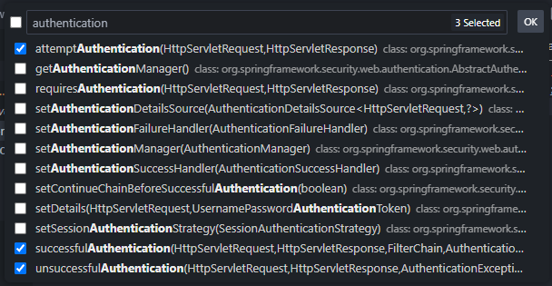
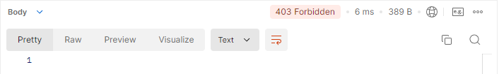

# backend-usersapp

### **Métodos CRUD Automáticos en Spring Data JPA**

Spring Data JPA simplifica enormemente las operaciones CRUD al proporcionar métodos predefinidos que no requieren implementación manual. Estos métodos están disponibles al extender la interfaz `CrudRepository` o sus derivados como `JpaRepository`.

### Ejemplo:

Se tiene la siguiente entidad

```java
import jakarta.persistence.Entity;
import jakarta.persistence.GeneratedValue;
import jakarta.persistence.GenerationType;
import jakarta.persistence.Id;
import jakarta.persistence.Column;

@Entity
public class User {

    @Id
    @GeneratedValue(strategy = GenerationType.IDENTITY)
    private Long id;

    // Garantiza que el campo username sea único en la base de datos
    @Column(unique = true) 
    private String username;

    private String email;
    private String password;

    // Getters y setters
}
```

A continuación, defines un repositorio para manejar las operaciones relacionadas con `User`:

```java
import org.springframework.data.repository.CrudRepository;

public interface UserRepository extends CrudRepository<User, Long> {
    // Puedes agregar métodos personalizados si lo necesitas
    User findByUsername(String username);
}
```

### Métodos CRUD Automáticos Disponibles

Al extender `CrudRepository`, obtienes los siguientes métodos listos para usar:

- **`save(S entity)`**: Guarda una nueva entidad o actualiza una existente.

- **`findById(ID id)`**: Encuentra una entidad por su ID.

- **`findAll()`**: Obtiene una lista de todas las entidades en la tabla.

- **`deleteById(ID id)`**: Elimina una entidad por su ID.

### La "Magia" de JPA y Hibernate

Spring Data JPA se basa en JPA (Java Persistence API) y utiliza Hibernate como implementación predeterminada para manejar la persistencia de datos. Esta integración ofrece múltiples beneficios:

1. **Mapeo Objeto-Relacional (ORM)**:
   
   - Hibernate traduce las clases de Java y sus relaciones en tablas y consultas SQL. Por ejemplo:
     - Una clase `User` con atributos como `id`, `username` y `email` se convierte en una tabla `users` con columnas correspondientes.

2. **Consultas SQL Automáticas**:
   
   - Métodos como `save` o `findById` generan automáticamente las consultas SQL necesarias para interactuar con la base de datos según el dialecto configurado en `application.properties`.

3. **Configuración de Dialecto SQL**:
   
   - El dialecto determina cómo Hibernate traduce las operaciones a instrucciones SQL compatibles con tu base de datos.
   
   - Ejemplo: `spring.jpa.database-platform=org.hibernate.dialect.MySQLDialect`

### ORM: La Base de Todo

ORM (Object-Relational Mapping) es una técnica que permite trabajar con la base de datos como si fuera un conjunto de objetos en lugar de usar consultas SQL directamente. Los beneficios incluyen:

- Reducción de código repetitivo.
- Mantenimiento más sencillo gracias a la programación orientada a objetos.
- Portabilidad entre diferentes bases de datos con cambios mínimos en la configuración.

## Implementación de un Servicio para Métodos CRUD

Una buena práctica al desarrollar con Spring Boot es implementar un **servicio intermedio** entre los controladores y los repositorios. Esto permite desacoplar la lógica de negocio de la lógica de acceso a datos.

### Definición de la Interfaz del Servicio

Crea una interfaz que defina los métodos que tu servicio debe implementar. Por ejemplo:

```java
package com.example.backendcartapp.services;

import com.example.backendcartapp.models.entities.User;
import java.util.List;
import java.util.Optional;

public interface UserService {

    // Métodos CRUD básicos
    User save(User user);
    Optional<User> findById(Long id);
    List<User> findAll();
    void deleteById(Long id);

    // Métodos personalizados
    Optional<User> findByUsername(String username);
}
```

### Implementación del Servicio

Crea una clase que implemente esta interfaz. Al hacerlo, tu IDE puede ayudarte a generar automáticamente los métodos de la interfaz.

```java
package com.example.backendcartapp.services.impl;

import com.example.backendcartapp.models.entities.User;
import com.example.backendcartapp.repositories.UserRepository;
import com.example.backendcartapp.services.UserService;
import org.springframework.stereotype.Service;

import java.util.List;
import java.util.Optional;

@Service
public class UserServiceImpl implements UserService {

    private final UserRepository userRepository;

    public UserServiceImpl(UserRepository userRepository) {
        this.userRepository = userRepository;
    }

    @Override
    public User save(User user) {
        return userRepository.save(user);
    }

    @Override
    public Optional<User> findById(Long id) {
        return userRepository.findById(id);
    }

    @Override
    public List<User> findAll() {
        return (List<User>) userRepository.findAll();
    }

    @Override
    public void deleteById(Long id) {
        userRepository.deleteById(id);
    }

    @Override
    public Optional<User> findByUsername(String username) {
        return Optional.ofNullable(userRepository.findByUsername(username));
    }
}
```

### Atajos en VSCode para Agregar Métodos de Forma Automática

Si estás usando un IDE como **Visual Studio Code**, puedes facilitar la implementación de los métodos de la interfaz siguiendo estos pasos:

1. **Usar el Menú Contextual**:
   
   - Haz clic derecho en el código dentro de tu clase `UserServiceImpl`.
   - Selecciona **Source Action...** > **Override/Implement Methods...**.
   - Aparecerá un listado de métodos definidos en la interfaz `UserService`. Selecciona los que deseas implementar y presiona **OK**.

2. **Usar el Atajo de Teclado**:
   
   - Coloca el cursor sobre el nombre de la clase `UserServiceImpl`.
   - Presiona **CTRL + .** (o CMD + . en macOS).
   - Selecciona **Add unimplemented methods** en el menú de **Quick Fix**.
   - Esto generará automáticamente los métodos no implementados en tu clase.

## Ruta Dinámica en el Controlador

El controlador `UserController` implementa rutas dinámicas que permiten interactuar con usuarios específicos según el ID proporcionado en la URL. A continuación, se detallan los aspectos clave y ejemplos prácticos de implementación.

### 1. Ruta dinámica utilizando `@PathVariable`

El método `show` mapea la ruta `GET /users/{id}` donde `{id}` es una variable dinámica que se extrae mediante la anotación `@PathVariable`.

```java
@RestController
@RequestMapping("/users")
public class UserController {

    @Autowired
    private UserService service;

    @GetMapping("/{id}")
    public User show(@PathVariable Long id) {
        // orElseThrow -> Manejo directo de ausencia de datos.
        return service.findById(id).orElseThrow(); 
    }
}
```

**Notas:**

- Si no se encuentra el usuario, `orElseThrow()` lanza una excepción como `NoSuchElementException` por defecto.
- Puedes personalizar la excepción si necesitas un mensaje específico o manejar un caso más particular.

### 2. Utilizando `@PathVariable(name = "id")`

Es posible especificar explícitamente el nombre del parámetro en la URL para evitar errores de coincidencia en rutas complejas o por convención.

```java
@GetMapping("/{id}")
public User show(@PathVariable(name = "id") Long idUser) {
    return service.findById(idUser).orElseThrow();
}
```

Aunque no es obligatorio si el nombre coincide, esta práctica puede ser útil para aumentar la legibilidad del código.

### 3. Devolver respuestas completas con `ResponseEntity`

En lugar de devolver directamente un objeto `User`, puedes usar `ResponseEntity` para proporcionar una respuesta más robusta, incluyendo códigos de estado HTTP.

```java
@GetMapping("/{id}")
public ResponseEntity<?> show(@PathVariable Long id) {
    Optional<User> userOptional = service.findById(id);

    if (userOptional.isPresent()) {
        // HTTP 200 con el usuario encontrado.
        return ResponseEntity.ok(userOptional.get()); 
    }

    // HTTP 404 si el usuario no existe.
    return ResponseEntity.notFound().build(); 
}
```

**Ventajas:**

- **Mejor manejo de errores:** Devuelve códigos HTTP precisos (`200 OK`, `404 Not Found`).
- **Flexibilidad:** Permite incluir cabeceras o modificar la respuesta.

### **4. Configuración personalizada para errores (Opcional)**

Puedes lanzar una excepción personalizada si el usuario no existe y manejarla globalmente en tu aplicación.

```java
public class UserNotFoundException extends RuntimeException {
    public UserNotFoundException(String message) {
        super(message);
    }
}
```

```java
@GetMapping("/{id}")
public User show(@PathVariable Long id) {
    return service.findById(id).orElseThrow(() -> 
        new UserNotFoundException("User not found with ID: " + id)
    );
}
```

## Método POST: Crear un Usuario

El método POST en el controlador permite crear un nuevo usuario recibiendo un objeto `User` en el cuerpo de la petición. Este objeto se almacena en la base de datos utilizando el servicio correspondiente.

### **1. Implementación básica con `@ResponseStatus`**

En esta implementación, el método devuelve el usuario creado y utiliza la anotación `@ResponseStatus` para indicar un estado HTTP 201 (Created).

```java
@PostMapping
@ResponseStatus(HttpStatus.CREATED) // Indica que el estado HTTP de la respuesta es 201.
public User create(@RequestBody User user) {
    return service.save(user); // Guarda el usuario en la base de datos y lo devuelve.
}
```

**Ventajas:**

- Simple y directo.
- Estado HTTP 201 es automático gracias a `@ResponseStatus`.

**Consideración:**

- No permite incluir cabeceras adicionales ni personalizar más allá del cuerpo de la respuesta.

### 2. Implementación avanzada con `ResponseEntity`

Para una respuesta más personalizada, puedes usar `ResponseEntity`. Esto te permite controlar tanto el código de estado como el cuerpo y, opcionalmente, añadir cabeceras HTTP.

```java
@PostMapping
public ResponseEntity<?> create(@RequestBody User user) {
    // Guarda el usuario en la base de datos.
    User userDb = service.save(user);

    // Devuelve una respuesta con estado 201 y el usuario creado en el cuerpo.
    return ResponseEntity.status(HttpStatus.CREATED).body(userDb);
}
```

**Ventajas:**

- Permite personalizar completamente la respuesta.
- Más flexible si en el futuro necesitas añadir cabeceras o estados diferentes.

## Actualizar un recurso existente en la base de datos (PUT)

El método `update` busca un recurso en la base de datos por su identificador (`id`) y, si se encuentra, actualiza ciertos campos permitidos del objeto, como `username` y `email`. Si el recurso no existe, devuelve un error HTTP 404 (`Not Found`).

```java
@PutMapping("/{id}")
public ResponseEntity<?> update(@RequestBody User user, @PathVariable Long id) {
    // Busca el recurso en la base de datos
    Optional<User> o = service.findById(id);

    // Verifica si el recurso existe
    if (o.isPresent()) {
        User userDb = o.orElseThrow(); // Obtiene el usuario desde el Optional

        // Actualiza solo los campos permitidos
        userDb.setUsername(user.getUsername());
        userDb.setEmail(user.getEmail());

        // Guarda el recurso actualizado en la base de datos
        User updatedUser = service.save(userDb);

        // Devuelve una respuesta con el recurso actualizado
        return ResponseEntity.ok(updatedUser); // HTTP 200 OK
    }

    // Devuelve un error 404 si el recurso no se encuentra
    return ResponseEntity.notFound().build();
}
```

#### **Notas importantes:**

- Se utiliza `ResponseEntity.ok()` para devolver el recurso actualizado con un estado HTTP 200 (`OK`).
- Solo los campos `username` y `email` se actualizan. Otros campos sensibles, como `password`, no se modifican por razones de seguridad.
- Si el recurso no existe (`Optional.isPresent()` es falso), se devuelve un estado HTTP 404.

### Eliminar un recurso existente en la base de datos (DELETE)

El método `remove` elimina un recurso existente de la base de datos por su identificador (`id`). Si el recurso no existe, devuelve un error HTTP 404 (`Not Found`).

```java
@DeleteMapping("/{id}")
public ResponseEntity<?> remove(@PathVariable Long id) {
    // Busca el recurso en la base de datos
    Optional<User> o = service.findById(id);

    // Verifica si el recurso existe
    if (o.isPresent()) {
        // Elimina el recurso por su ID
        service.remove(id);

        // Devuelve una respuesta HTTP 204 (No Content) si se eliminó correctamente
        return ResponseEntity.noContent().build();
    }

    // Devuelve un error 404 si el recurso no se encuentra
    return ResponseEntity.notFound().build();
}
```

#### **Notas importantes:**

- El estado HTTP 204 (`No Content`) indica que el recurso fue eliminado correctamente y no hay contenido en la respuesta.
- Si el recurso no existe, devuelve un estado HTTP 404 (`Not Found`).

## Diferencia entre controlador y servicio

La separación entre el controlador y el servicio es crucial para mantener un código limpio, modular y fácil de mantener. El objetivo principal del controlador es manejar solicitudes HTTP y delegar la lógica de negocio al servicio. Aquí explicamos las diferencias y cómo la refactorización propuesta mejora el diseño.

| **Aspecto**                | **Controlador**                                                                                        | **Servicio**                                                                                                       |
| -------------------------- | ------------------------------------------------------------------------------------------------------ | ------------------------------------------------------------------------------------------------------------------ |
| **Responsabilidad**        | Manejar solicitudes HTTP, procesar parámetros de la ruta, cuerpo de la petición y preparar respuestas. | Encapsular la lógica de negocio, realizar operaciones con los datos y manejar la interacción con la base de datos. |
| **Nivel de abstracción**   | Interactúa directamente con el cliente (interfaz pública de la API).                                   | Se centra en la lógica de negocio y las operaciones de datos (detrás de escena).                                   |
| **Ejemplo de operaciones** | Validar datos de entrada, definir las rutas y devolver respuestas HTTP.                                | Consultar la base de datos, realizar cálculos, manejar reglas de negocio y coordinar transacciones.                |

### Refactorización del método `update`

#### Implementación en el Servicio (`UserService`)

El servicio se encarga de toda la lógica relacionada con la actualización de un recurso, como buscar el usuario, verificar su existencia, actualizar los campos y guardar los cambios en la base de datos.

```java
@Override
@Transactional
public Optional<User> update(User user, Long id) {
    // Busca el usuario por su ID
    Optional<User> o = this.findById(id);

    // Define el objeto para el resultado de la operación
    User userOptional = null;

    // Si el usuario existe, actualiza sus campos
    if (o.isPresent()) {
        User userDb = o.orElseThrow();
        userDb.setUsername(user.getUsername());
        userDb.setEmail(user.getEmail());

        // Guarda los cambios y asigna el resultado
        userOptional = this.save(userDb);
    }

    // Devuelve un Optional con el resultado
    return Optional.ofNullable(userOptional);
}
```

### Implementación en el Controlador

El controlador simplemente llama al servicio y gestiona la respuesta HTTP, sin involucrarse en la lógica de negocio. Esto simplifica y limpia el código.

```java
@PutMapping("/{id}")
public ResponseEntity<?> update(@RequestBody User user, @PathVariable Long id) {
    // Llama al método `update` del servicio
    Optional<User> o = service.update(user, id);

    // Si el recurso se actualizó correctamente
    if (o.isPresent()) {
        // Devuelve el recurso actualizado con el estado HTTP 201 (Created)
        return ResponseEntity.status(HttpStatus.CREATED).body(o.orElseThrow());
    }

    // Si no se encontró el recurso, devuelve un error 404
    return ResponseEntity.notFound().build();
}
```

## Diferencia entre repository y this en el servicio

### 1. Usar `repository` directamente

Cuando usas `repository` en la capa de servicio, estás accediendo directamente a los métodos del repositorio (que son proporcionados por Spring Data JPA, como `save`, `findById`, `deleteById`, etc.). Esto es lo más común en la mayoría de los casos.

```java
@Service
public class UserService {

    @Autowired
    private UserRepository repository;

    public User save(User user) {
        return repository.save(user);
    }
}
```

**Ventajas:**

- **Claro y explícito:** Es evidente que el repositorio está gestionando la interacción con la base de datos.
- **Control preciso:** Puedes usar los métodos del repositorio directamente y, si es necesario, añadir consultas personalizadas (`@Query`).

**Desventajas:**

- Si necesitas lógica adicional antes de guardar o recuperar un dato, debes implementarla manualmente en el servicio.

### 2. Usar `this` dentro de la misma clase

Cuando usas `this` en la capa de servicio, estás llamando a un método definido en la misma clase. Esto puede incluir llamadas indirectas a los métodos del repositorio, pero no interactúas directamente con él.

```java
@Service
public class UserService {

    @Autowired
    private UserRepository repository;

    public User save(User user) {
        // Llama a otro método de la misma clase
        return this.processAndSave(user);
    }

    private User processAndSave(User user) {
        // Agrega lógica adicional antes de guardar
        user.setUsername(user.getUsername().toLowerCase());
        return repository.save(user);
    }
}
```

**Ventajas:**

- **Encapsulación:** Puedes envolver la lógica de negocio antes de llamar al repositorio.
- **Reutilización interna:** Es útil cuando necesitas separar la lógica en métodos pequeños dentro de la misma clase.

**Desventajas:**

- Si necesitas proxy dinámico (como transacciones), `this` no lo aplicará automáticamente porque Spring no intercepta llamadas internas de la misma clase.

### **3. Usar `this` vs. `repository` con transacciones**

Un caso importante a considerar es cuando se trabaja con transacciones (`@Transactional`). Spring usa proxies dinámicos para manejar las transacciones, pero **las llamadas internas a métodos dentro de la misma clase** (usando `this`) no serán interceptadas por el proxy, y la transacción no funcionará como esperas.

```java
@Service
public class UserService {

    @Autowired
    private UserRepository repository;

    @Transactional
    public void performOperation() {
        // Esto será transaccional
        this.save(new User());
    }

    @Transactional
    public User save(User user) {
        // Esto NO será transaccional si se llama desde otro método usando `this`
        return repository.save(user);
    }
}
```

En este caso, **si usas `repository` directamente o llamas al método desde fuera de la clase (por ejemplo, desde el controlador), el proxy sí aplicará la transacción**.

## Pruebas iniciales

Las pruebas iniciales en **Postman** son esenciales para verificar el correcto funcionamiento de los endpoints creados.

### Preparación previa

1. **Base de datos:**
   
   - Asegúrate de haber creado la base de datos en MySQL utilizando el nombre especificado en `application.properties`.
     
     ```properties
     spring.datasource.url=jdbc:mysql://localhost:3306/db_users_springboot
     spring.datasource.username=root
     spring.datasource.password=admin
     spring.datasource.driver-class-name=com.mysql.cj.jdbc.Driver
     spring.jpa.database-platform=org.hibernate.dialect.MySQLDialect
     spring.jpa.show-sql=true
     
     # TIP: primero ejecuta la aplicación y luego mientras se esta ejecutando, cambia create por update para mantener los datos
     spring.jpa.hibernate.ddl-auto=create
     logging.level.org.hibernate.SQL=debug
     ```
   
   - En MySQL Workbench, ejecuta el siguiente comando para verificar que la tabla está vacía:
     
     ```sql
     SELECT * FROM db_users_springboot.users;
     ```

2. **Ejecuta el proyecto:**
   
   - Corre la aplicación Spring Boot. Por defecto, estará disponible en `http://localhost:8080`.

### Pruebas en Postman

#### 1. Prueba inicial del endpoint GET (/users)

- **Método:** GET

- **Ruta:** `http://localhost:8080/users`

- **Resultado esperado:** Un arreglo vacío si no hay usuarios creados.

- **Respuesta esperada:**
  
  ```json
  []
  ```

#### 2. Prueba del endpoint GET por ID (/users/{id})

- **Método:** GET

- **Ruta:** `http://localhost:8080/users/1`

- **Caso 1: Usuario no encontrado.**
  
  - **Resultado esperado:** Código HTTP 404 (`Not Found`)
  - **Respuesta esperada:** Vacía.

- **Caso 2: Usuario encontrado.**
  
  - Si existe un usuario con el ID `1`, devuelve los datos del usuario:
    
    ```json
    {
      "id": 1,
      "username": "pepe",
      "email": "pepe@correo.com",
      "password": "12345"
    }
    ```

#### 3. Prueba del endpoint POST (Crear usuario)

- **Método:** POST

- **Ruta:** `http://localhost:8080/users`

- **Body:**
  
  - Selecciona **Body > raw** y configura el tipo como **JSON**.
  
  - Envía un JSON con los datos del nuevo usuario:
    
    ```json
    {
      "username": "pepe",
      "email": "pepe@correo.com",
      "password": "12345"
    }
    ```

- **Resultado esperado:**
  
  - Código HTTP 201 (`Created`).
  
  - Respuesta con el usuario creado (incluye el ID asignado):
    
    ```json
    {
      "id": 1,
      "username": "pepe",
      "email": "pepe@correo.com",
      "password": "12345"
    }
    ```

- **Verificación:**
  
  - En MySQL Workbench, ejecuta nuevamente:
    
    ```sql
    SELECT * FROM db_users_springboot.users;
    ```
  
  - Deberías ver el nuevo registro en la tabla.

#### 4. Prueba del endpoint PUT (Actualizar usuario)

- **Método:** PUT

- **Ruta:** `http://localhost:8080/users/1`

- **Body:**
  
  - Envía un JSON sin incluir el campo `password`:
    
    ```json
    {
      "username": "pepe_updated",
      "email": "pepe_updated@correo.com"
    }
    ```

- **Caso 1: Usuario encontrado.**
  
  - **Resultado esperado:** Código HTTP 201 (`Created`).
  
  - **Respuesta esperada:** El usuario actualizado:
    
    ```json
    {
      "id": 1,
      "username": "pepe_updated",
      "email": "pepe_updated@correo.com",
      "password": "12345"
    }
    ```
  
  - **Verificación:** Realiza una petición GET al mismo ID (`/users/1`) para confirmar los cambios.

- **Caso 2: Usuario no encontrado.**
  
  - **Resultado esperado:** Código HTTP 404 (`Not Found`).
  - **Respuesta esperada:** Vacía.

#### 5. Prueba del endpoint DELETE (Eliminar usuario)

- **Método:** DELETE

- **Ruta:** `http://localhost:8080/users/1`

- **Body:** No envíes ningún cuerpo (vacío).

- **Caso 1: Usuario encontrado.**
  
  - **Resultado esperado:** Código HTTP 204 (`No Content`).
  - **Respuesta esperada:** Vacía.
  - **Verificación:** Realiza una petición GET al mismo ID (`/users/1`) y debería devolver un código HTTP 404.

- **Caso 2: Usuario no encontrado.**
  
  - **Resultado esperado:** Código HTTP 404 (`Not Found`).
  - **Respuesta esperada:** Vacía.

### Puntos importantes

1. **Verificación en MySQL Workbench:**
   
   - Después de cada operación, verifica el estado de la tabla con:
     
     ```sql
     SELECT * FROM db_users_springboot.users;
     ```

2. **Manejo de errores:**
   
   - Asegúrate de que las respuestas de error (`404 Not Found`) sean coherentes según lo esperado.

3. **Tipos de datos en JSON:**
   
   - Utiliza cadenas de texto para los campos `username`, `email` y `password`.

4. **Uso de ResponseEntity:**
   
   - Verifica que los códigos de estado HTTP (`201`, `404`, `204`) coincidan con lo definido en el controlador.

### Resultados esperados por escenario

| **Método** | **Ruta**   | **Entrada**                        | **Resultado esperado** |
| ---------- | ---------- | ---------------------------------- | ---------------------- |
| **GET**    | `/users`   | N/A                                | `[]`                   |
| **GET**    | `/users/1` | N/A                                | 404 o el usuario       |
| **POST**   | `/users`   | JSON con `username`, `email`, etc. | Usuario creado (201)   |
| **PUT**    | `/users/1` | JSON con campos actualizados       | Usuario actualizado    |
| **DELETE** | `/users/1` | N/A                                | 204 o 404              |

Con estas pruebas iniciales, podrás validar que los endpoints funcionan según lo esperado y cumplen con las reglas de negocio establecidas.

## Validaciones

En el código mostrado, se implementan validaciones en los campos de la clase `User` para garantizar que los datos sean correctos antes de persistirlos en la base de datos.

### 1. Dependencia para Validación

La dependencia `spring-boot-starter-validation` añade soporte para el marco de validación de Java Bean Validation, que está basado en las especificaciones **Jakarta Validation** (anteriormente Javax). Esto incluye un conjunto estándar de anotaciones como `@NotNull`, `@NotEmpty`, `@Size`, entre otras, para validar los datos de entrada.

```xml
<dependency>
    <groupId>org.springframework.boot</groupId>
    <artifactId>spring-boot-starter-validation</artifactId>
</dependency>
```

### 2. Validaciones Implementadas

#### @NotBlank

- Valida que un campo de tipo `String` no sea `null`, esté vacío, ni contenga solo espacios en blanco.

#### @Size

- Restringe la longitud de una cadena (o el tamaño de una colección).

```java
@NotBlank
@Size(min = 4, max = 8)
private String username;
```

#### @NotEmpty

- Valida que un campo no sea `null` ni una cadena vacía (`""`).
- Es menos estricta que `@NotBlank` porque permite cadenas con espacios en blanco.

```java
@NotEmpty
private String password;
```

#### **@Email**

- Valida que el campo contenga un formato válido de dirección de correo electrónico.
- Debe ser usado junto con `@NotEmpty` para evitar valores `null` o cadenas vacías.

#### **@Column(unique = true)**

- Define que el valor del campo debe ser único en la base de datos.

```java
@Email
@NotEmpty
@Column(unique = true)
private String email;
```

### 3. Personalización de mensajes de error

Puedes personalizar los mensajes de validación usando el atributo `message` en las anotaciones. Por ejemplo:

```java
@NotBlank(message = "El nombre de usuario no puede estar vacío ni contener solo espacios en blanco.")
@Size(min = 4, max = 8, message = "El nombre de usuario debe tener entre 4 y 8 caracteres.")
private String username;
```

Si la validación falla, este mensaje personalizado será incluido en la respuesta de error.

### 4. Manejo de Errores en el Controlador

Para que las validaciones se activen, agrega la anotación `@Valid` en el controlador, en los métodos donde se recibe un `@RequestBody`.

- **`@Valid`:** Activa las validaciones definidas en la entidad.
- **`BindingResult`:** Captura los errores de validación, que luego puedes procesar para generar una respuesta clara.

```java
@PostMapping
public ResponseEntity<?> create(@Valid @RequestBody User user, BindingResult result) {
    // Verifica si hay errores en la validación
    if (result.hasErrors()) {
        // Se crea un List que contendrá los mensajes de validación
        List<String> errors = result.getFieldErrors()
                                    .stream()
                                    .map(err -> "El campo '" + err.getField() + "' " + err.getDefaultMessage())
                                    .collect(Collectors.toList());
        return ResponseEntity.badRequest().body(errors);
    }

    return ResponseEntity.status(HttpStatus.CREATED).body(service.save(user));
}
```

### 5. Ejemplo de Respuesta de Error en JSON

Si intentas crear un usuario con un correo inválido o un nombre de usuario vacío, obtendrás una respuesta similar a esta:

```java
[
    "El campo 'username' El nombre de usuario no puede estar vacío ni contener solo espacios en blanco.",
    "El campo 'email' debe ser una dirección de correo electrónico válida."
]
```

### 6. Beneficios de Usar Validaciones

- **Prevención de datos inválidos:** Evita errores a nivel de base de datos y mejora la calidad de los datos almacenados.
- **Respuestas claras:** Proporciona retroalimentación inmediata al usuario sobre problemas con los datos enviados.
- **Centralización de reglas:** Las reglas de validación están definidas directamente en la entidad, asegurando consistencia en toda la aplicación.

## Validación reutilizable

El siguiente método encapsula la lógica para manejar errores de validación y se invoca siempre que los datos recibidos no cumplan con las reglas definidas en las anotaciones de validación (`@NotBlank`, `@Email`, etc.).

### **1. Método `validation`**

- **Entrada:** Un objeto `BindingResult`, que contiene los errores de validación detectados.
- **Salida:** Una respuesta HTTP 400 (Bad Request) con un cuerpo JSON que detalla los errores.

```java
private ResponseEntity<?> validation(BindingResult result) {
    // Se utiliza un Map, la diferencia es que un map contiene pares de llave y valor
    Map<String, String> errors = new HashMap<>();

    // Obtiene los mensajes de errores y realiza una iteración
    // En errors se almacena un Map que contiene el nombre del campo y el mensaje de error relacionado al campo
    result.getFieldErrors().forEach(err -> {
        // getField() -> Obtiene el nombre del campo
        // getDefaultMessage() -> el mensaje de error
        errors.put(err.getField(), "El campo " + err.getField() + " " + err.getDefaultMessage());
    });

    return ResponseEntity.badRequest().body(errors);
}
```

### Ventajas

- Centraliza el manejo de errores, reduciendo duplicación de código.
- Genera un mensaje de error claro y estructurado para el cliente.
- Simplifica la lógica en los controladores.

## 2. Uso de la clase `UserRequest` en lugar de `User`

Se introduce una clase `UserRequest` para manejar peticiones que no necesitan todas las propiedades de la entidad `User`. Esto mejora la separación de responsabilidades y evita exponer la estructura completa de la entidad al cliente.

### Diferencias clave

- **Clase `User`:** Representa la entidad persistente en la base de datos.
- **Clase `UserRequest`:** Representa el cuerpo de una petición HTTP para actualizar un usuario. Solo incluye los campos necesarios (`username`, `email` y `admin`).

```java
public class UserRequest implements IUser {
    @NotBlank
    @Size(min = 4, max = 8)
    private String username;

    // Se omite el campo password

    @NotEmpty
    @Email
    private String email;

    private boolean admin;
    // Getters y Setters...
}
```

### Beneficios

- Protege la entidad `User` de manipulaciones innecesarias o inseguras.
- Hace que las peticiones sean más claras y específicas para su propósito.

## 3. Actualización de usuarios con validación

En el servicio (`service.update`), se realiza la lógica de actualización, utilizando un **mapeador** para convertir un `UserRequest` en una entidad `User`.

```java
public Optional<UserDto> update(UserRequest userRequest, Long id) {
    return repository.findById(id).map(user -> {
        user.setUsername(userRequest.getUsername());
        user.setEmail(userRequest.getEmail());
        user.setAdmin(userRequest.isAdmin());
        repository.save(user);
        return mapper.toDto(user); // Convierte la entidad actualizada en un DTO
    });
}
```

El controlador utiliza `@Valid` para activar las validaciones definidas en `UserRequest` al recibir una solicitud. Si las validaciones fallan, se llama al método `validation`.

```java
@PutMapping("/{id}")
public ResponseEntity<?> update(@Valid @RequestBody UserRequest user, BindingResult result, @PathVariable Long id) {
    if (result.hasErrors()) {
        return validation(result);
    }

    Optional<UserDto> o = service.update(user, id);

    if (o.isPresent()) {
        return ResponseEntity.status(HttpStatus.CREATED).body(o.orElseThrow());
    }

    return ResponseEntity.notFound().build();
}
```

**Nota**: Se tiene en cuenta que el método `validation` se encuentre definido en el mismo controlador que contiene los endpoints.

## Spring Security

**Spring Security** es un marco de trabajo que permite implementar seguridad en aplicaciones basadas en Java. Al usar **JWT (JSON Web Tokens)**, se puede garantizar la autenticación y autorización de usuarios de forma eficiente en aplicaciones **API REST**.

### Características clave de JWT

1. **Estandarizado:** Basado en la especificación RFC 7519, permite interoperabilidad entre aplicaciones cliente y servidor.
2. **Autenticación sin estado:** No requiere almacenar sesiones en el servidor, haciendo que sea más escalable.
3. **Compacto y ligero:** Gracias a su tamaño reducido, se transmite fácilmente en cabeceras HTTP.
4. **Autónomo:** Contiene toda la información necesaria sobre el usuario, como el username y roles, pero no información sensible (como contraseñas).
5. **Seguro:** Se firma con una llave secreta para garantizar autenticidad, pero **no está encriptado**, solo codificado en Base64, por lo que puede ser leído.

### Proceso de autenticación:

1. El cliente envía un **username** y **password** al backend a través de un endpoint (ejemplo: `/login`).
2. Spring Security valida las credenciales contra la base de datos.
   - Si no son válidas: retorna un error `401 Unauthorized`.
   - Si son válidas:
     - Genera un JWT firmado con una llave secreta.
     - Envía el JWT al cliente en la respuesta (`200 OK`).
3. El cliente almacena el token en el **localStorage** o **sessionStorage** para futuras solicitudes.


### Acceso a recursos protegidos:

1. El cliente incluye el JWT en las cabeceras HTTP (`Authorization: Bearer <token>`).
2. Spring Security intercepta la solicitud con un filtro:
   - Verifica la firma y validez del token (expiración, manipulación).
   - Extrae los datos del usuario (username y roles).
3. Según los roles del usuario, se otorgan o deniegan los permisos:
   - Si no tiene permisos: retorna un error `403 Forbidden`.
   - Si tiene permisos: accede al recurso y devuelve la información (`200 OK`).


### Ventajas del uso de JWT con Spring Security

- **Escalabilidad:** No depende de sesiones almacenadas en el servidor.
- **Integración:** Funciona con cualquier cliente (React, Angular, backend de otros microservicios).
- **Optimización:** Reducción de consultas al servidor, ya que la información necesaria está en el token.

### Consideraciones de seguridad

- Nunca almacenar datos sensibles (contraseñas, información financiera) en el JWT.
- Usar HTTPS para proteger la transmisión del token.
- Configurar adecuadamente la expiración del token para mitigar riesgos.

Este modelo permite implementar una solución segura, eficiente y desacoplada para gestionar la autenticación en aplicaciones modernas basadas en APIs REST.

## Configuración de Spring Security para una API RESTful

Para implementar Spring Security en la API, sigue estos pasos:

### 1. Dependencia de Spring Security

Agrega la dependencia de Spring Security en el archivo `pom.xml`. Recuerda que en VSCode puedes pulsar la tecla `F1`, escribir en el buscador `> Spring Initializr: Add Starters...` y selecciona la dependencia de **Spring Security**.

```xml
<dependency>
    <groupId>org.springframework.boot</groupId>
    <artifactId>spring-boot-starter-security</artifactId>
</dependency>
```

Por defecto, al iniciar la aplicación, Spring Security bloquea todas las rutas y genera una contraseña temporal para desarrollo (la contraseña se puede ver en la consola).

### 2. Clase SpringSecurityConfig

Crea una clase de configuración (en este caso `SpringSecurityConfig`) dentro de un paquete `auth`.


Agrega la anotación `@Configuration` en la clase. Define un método `filterChain` anotado con `@Bean` para configurar las reglas de seguridad.

```java
package com.andres.backend.usersapp.backend_usersapp.auth;

import org.springframework.context.annotation.Bean;
import org.springframework.context.annotation.Configuration;
import org.springframework.http.HttpMethod;
import org.springframework.security.config.annotation.web.builders.HttpSecurity;
import org.springframework.security.config.http.SessionCreationPolicy;
import org.springframework.security.web.SecurityFilterChain;


// Anotación para la configuración de la seguridad
// Se importa de org.springframework.context...
@Configuration
public class SpringSecurityConfig {

    // Bean almacena el metodo como un componente de Spring (similar a @Service)
    @Bean
    // Metodo para configurar las reglas de autenticación y autorización
    SecurityFilterChain filterChain(HttpSecurity http) throws Exception {
        return http
                // Configuración de reglas de autorización
                .authorizeHttpRequests(
                    // Permitir acceso público solo para solicitudes GET a "/users"
                    .requestMatchers(HttpMethod.GET, "/users").permitAll()
                    // Requerir autenticación para cualquier otra solicitud
                    .anyRequest().authenticated()
                )
                // Deshabilitar CSRF, ya que no se utiliza en APIs RESTful
                .csrf(csrf -> csrf.disable())
                // Configuración para manejar sesiones sin estado (stateless)
                .sessionManagement(session -> session.sessionCreationPolicy(SessionCreationPolicy.STATELESS))
                // Construir y devolver la configuración de seguridad
                .build();
    }
}
```

### 3. Resumen de configuración

1. **Reglas de autorización**
   
   - Usa `authorizeHttpRequests()` para definir qué rutas están permitidas y cuáles requieren autenticación:
   - Permite solicitudes GET a `/users` con `.requestMatchers(HttpMethod.GET, "/users").permitAll()`.
   - Requiere autenticación para cualquier otra ruta con `.anyRequest().authenticated()`.

2. **CSRF deshabilitado**
   
   - Deshabilita **Cross-Site Request Forgery (CSRF)** con `.csrf(csrf -> csrf.disable())`.
   - CSRF se utiliza en aplicaciones monolíticas con formularios, pero no es necesario en APIs RESTful.

3. **Sesión sin estado (stateless)**
   
   - Configura el manejo de sesiones con `.sessionManagement(session -> session.sessionCreationPolicy(SessionCreationPolicy.STATELESS))`
     
     - Esto asegura que la API no use sesiones HTTP persistentes.
     - En su lugar, la autenticación se manejará mediante un token JWT enviado con cada solicitud.

### 4. Pruebas con Postman

1. **GET /users**
   
   - Debería devolver la lista de usuarios sin problemas (siempre que el controlador correspondiente esté configurado correctamente).

2. **GET /users/1**, **POST /users**, o **DELETE /users/1**
   
   - Responderá con `403 Forbidden`, ya que no hay un token JWT configurado para manejar la autenticación.


## Creación y Configuración del Filtro de Autenticación con JWT en Spring Security

### 1. ¿Por qué crear un filtro personalizado?

Spring Security, por defecto, usa un formulario HTML para autenticación en aplicaciones monolíticas (MVC). Sin embargo, en una API REST, la autenticación debe realizarse enviando el `username` y `password` en un cuerpo JSON mediante una solicitud `POST`.

### 2. Creación del filtro personalizado

- Crea un paquete `filters` dentro del paquete `auth`.
- Dentro de este paquete, crea la clase `JwtAuthenticationFilter`.


### 3. Extender el filtro predeterminado

- La clase debe extender `UsernamePasswordAuthenticationFilter`, que es el filtro predeterminado de Spring para autenticación.

- Implementa los siguientes métodos clave:
  
  - `attemptAuthentication`: Para intentar autenticar al usuario.
  
  - `successfulAuthentication`: Llamado cuando la autenticación es exitosa (se generará el JWT aquí).
  
  - `unsuccessfulAuthentication`: Llamado cuando la autenticación falla (devuelve un error 403 con un mensaje al cliente).

- En VSCode puedes hacer clic derecho en el codigo, selecciona `Source Action`, opción `Override/Implement Methods` y marca los metodos claves mencionados anteriormente.



#### 3.1. Constructor personalizado

- Añade un atributo `AuthenticationManager` en la clase para delegar la autenticación.

- Define un constructor para inyectar el `AuthenticationManager`
  
  ```java
  private AuthenticationManager authenticationManager;
  
  public JwtAuthenticationFilter(AuthenticationManager authenticationManager) {
     this.authenticationManager = authenticationManager;
  }
  ```

#### 3.2. Implementación de los métodos clave

- **`attemptAuthentication`**
  Este método intentará autenticar al usuario.
  - Inicialmente, se devuelve una llamada a `authenticationManager.authenticate(null)`. Más adelante, se pasará un token de autenticación válido (como `UsernamePasswordAuthenticationToken`) con los datos enviados en la solicitud.
- **`successfulAuthentication`**
  Cuando la autenticación sea exitosa, este método:
  - Generará un token JWT.
  - Enviará el token como respuesta al cliente junto con los datos del usuario autenticado.
- **`unsuccessfulAuthentication`**
  Este método manejará los errores de autenticación:
  - Devuelve un código HTTP 403 Forbidden.
  - Proporciona un mensaje con detalles sobre el error.

## Implementando el método attemptAuthenticación

```java
    @Override
    public Authentication attemptAuthentication(HttpServletRequest request, HttpServletResponse response)
            throws AuthenticationException {
        User user = null;
        String username = null;
        String password = null;

        try {
            // Convertir el cuerpo del request JSON a la entidad User
            user = new ObjectMapper().readValue(request.getInputStream(), User.class);
            username = user.getUsername();
            password = user.getPassword();

            // Logging de debug
            logger.info("Username recibido: " + username);
            logger.info("Password recibido: " + password);

            // Se puede concatenar varios catch para manejar las excepciones
        } catch (IOException e) {
            logger.error("Error al procesar los datos de autenticación: " + e.getMessage());
            throw new RuntimeException("Error al leer los datos de autenticación", e);
        }

        // Crear el token de autenticación
        UsernamePasswordAuthenticationToken authToken = new UsernamePasswordAuthenticationToken(username, password);

        // Enviar el token al AuthenticationManager para que valide las credenciales
        return authenticationManager.authenticate(authToken);
    }
```

### Resumen

- **Deserialización del `request`**
  Usamos `ObjectMapper` para convertir el cuerpo del `request` en un objeto `User`. Esto es necesario porque el cliente envía los datos en formato JSON.

- **Creación del token de autenticación**
  Creamos un `UsernamePasswordAuthenticationToken` con el `username` y `password` extraídos. Este token será enviado al `AuthenticationManager` para que valide las credenciales.

### Generar un bloque try-catch

Luego de llamar al constructor `ObjectMapper`, obligatoriamente solicitara que ObjectMapper debe estar dentro un bloque try-catch. 

Para generar el bloque try-catch, coloca el cursor sobre `ObjectMapper` y selecciona `Quick Fix`, selecciona `Surround with try/catch` y el codigo contenido en el metodo se anida con try y catch.

```java
    @Override
    public Authentication attemptAuthentication(HttpServletRequest request, HttpServletResponse response)
            throws AuthenticationException {
        User user = null;
        String username = null;
        String password = null;

        user = new ObjectMapper().readValue(request.getInputStream(), User.class);
        return authenticationManager.authenticate(null);
    }
```

Se anidan varios bloques catch de forma automatica para manejar los errores que podrian ocurrir.

```java
    @Override
    public Authentication attemptAuthentication(HttpServletRequest request, HttpServletResponse response)
            throws AuthenticationException {
        User user = null;
        String username = null;
        String password = null;

        try {
            user = new ObjectMapper().readValue(request.getInputStream(), User.class);
        } catch (StreamReadException e) {
            e.printStackTrace();
        } catch (DatabindException e) {
            e.printStackTrace();
        } catch (IOException e) {
            e.printStackTrace();
        }
        return authenticationManager.authenticate(null);
    }
```

## Implementando el metodo successfulAuthentication

```java
import io.jsonwebtoken.Jwts;
import io.jsonwebtoken.SignatureAlgorithm;
import java.util.Date;

// ...

@Override
protected void successfulAuthentication(HttpServletRequest request, HttpServletResponse response, FilterChain chain,
        Authentication authResult) throws IOException, ServletException {

    // Obtiene el nombre de usuario del resultado de la autenticación
    String username = ((org.springframework.security.core.userdetails.User) authResult.getPrincipal())
            .getUsername();

    String secretKey = "MiClaveSecreta"; // Usar una clave secreta de manera segura

    // Generar un JWT real
    String jwtToken = Jwts.builder()
            .setSubject(username)
            .setExpiration(new Date(System.currentTimeMillis() + 86400000)) // Expira en 24 horas
            .signWith(SignatureAlgorithm.HS256, secretKey)
            .compact();

    // Añadir el token en el header Authorization
    response.addHeader("Authorization", "Bearer " + token);

    // Crear el cuerpo de la respuesta en formato JSON
    Map<String, Object> body = new HashMap<>();
    body.put("token", token);
    body.put("message", String.format("Hola %s, has iniciado sesión con éxito", username));
    body.put("username", username);

    // Escribir el cuerpo en la respuesta con un código de estado 200
    response.getWriter().write(new ObjectMapper().writeValueAsString(body));
    response.setStatus(200);
    response.setContentType("application/json");
}
```

### Resumen

La implementación del método `successfulAuthentication` en la clase `JwtAuthenticationFilter` parece estar en el camino correcto. Sin embargo, hay algunos detalles adicionales que podrías considerar para mejorar la gestión del flujo y asegurar que el token JWT sea más robusto.

1. **Generación del JWT**:
   
   - La forma en que estás generando el token usando Base64 es adecuada para fines de demostración, pero el estándar JWT generalmente incluye una firma (usando un algoritmo como HMAC o RSA) para verificar la autenticidad del token. Se recomienda usar una librería especializada como **jjwt** o **java-jwt** que proporciona una forma más estándar de crear y validar tokens JWT.
   - Si decides seguir con Base64, asegúrate de que la estructura del token sea válida, generalmente tiene tres partes: encabezado, cuerpo (payload) y firma, separados por puntos (`.`).

2. **Manejo de excepciones**:
   
   - Aunque manejas las excepciones al leer el JSON en el método `attemptAuthentication`, sería conveniente agregar un manejo de excepciones adecuado para el flujo completo, en especial en el método `successfulAuthentication`. Por ejemplo, si algo falla al agregar el token al header o escribir el cuerpo de la respuesta.

3. **Respuesta de JSON**:
   
   - El `response.setStatus(200)` es adecuado para indicar éxito. Sin embargo, para una mayor claridad y consistencia con las mejores prácticas, puedes manejar los posibles errores de autenticación (en el método `unsuccessfulAuthentication`) de manera que el cliente reciba respuestas adecuadas en caso de fallos, como un código de estado 401 para autenticación fallida.

4. **Uso de un Secret Key**:
   
   - En un JWT real, el secreto utilizado para firmar y verificar el token debe ser gestionado de manera segura (nunca lo pongas directamente en el código, usa un archivo de configuración o un servicio de gestión de secretos).

## Implemetando el método unsuccessfulAuthentication

```java
@Override
protected void unsuccessfulAuthentication(HttpServletRequest request, HttpServletResponse response,
        AuthenticationException failed) throws IOException, ServletException {

    // Crear un mapa para la respuesta
    Map<String, Object> body = new HashMap<>();

    // Mensaje genérico de error
    body.put("message", "Error en la autenticación, usuario o contraseña incorrectos");

    // Se puede agregar un error específico solo para los registros, no para el cliente
    // Se comenta esta línea para evitar enviar detalles del error
    // body.put("error", failed.getMessage());

    // Escribir el cuerpo de la respuesta como JSON
    response.getWriter().write(new ObjectMapper().writeValueAsString(body));

    // Establecer el código de estado como 401 (No autorizado)
    response.setStatus(401);

    // Establecer el tipo de contenido de la respuesta como JSON
    response.setContentType("application/json");
}
```

### Resumen

1. **Mensaje de error general**: Es importante mantener el mensaje de error genérico y no dar demasiada información sobre la causa del fallo (por ejemplo, si es un error de contraseña incorrecta o un nombre de usuario incorrecto). En tu implementación, el mensaje `"Error en la autenticación username o password incorrecto"` es adecuado, pero asegúrate de que no se revelen detalles sobre si es el nombre de usuario o la contraseña lo que está incorrecto.

2. **Incluir el mensaje de error específico**: La propiedad `failed.getMessage()` proporciona detalles específicos del error que ocurrió durante la autenticación. Esta es una buena práctica para mantener el registro del error en el lado del servidor, pero **no la incluyas en el cuerpo de la respuesta** que se enviará al cliente, ya que podría proporcionar más detalles de los necesarios.

3. **Estructura del JSON de error**: El `body` debería contener campos como `message` y `error` (por ejemplo, el mensaje genérico de error y una descripción corta del fallo). Esto ayuda al cliente a procesar la respuesta correctamente.

4. **Códigos de estado**: Ya estás utilizando el código de estado `401` para indicar que la autenticación ha fallado, lo cual es correcto.

## Configurando filtros en SpringSecurityConfig

La configuración del filtro `JwtAuthenticationFilter` en la clase `SpringSecurityConfig` es crucial para integrar el filtro de autenticación JWT en la cadena de seguridad de Spring. 

Esta es la forma correcta de inyectar el `AuthenticationManager` mediante `AuthenticationConfiguration` para pasar al filtro `JwtAuthenticationFilter`.

El filtro `JwtAuthenticationFilter` se agrega a la cadena de filtros utilizando `addFilter()`. Al filtro se le pasa el `AuthenticationManager` obtenido desde `authenticationConfiguration.getAuthenticationManager()`.

```java
package com.andres.backend.usersapp.backend_usersapp.auth;

import org.springframework.beans.factory.annotation.Autowired;
import org.springframework.context.annotation.Bean;
import org.springframework.context.annotation.Configuration;
import org.springframework.http.HttpMethod;
import org.springframework.security.config.annotation.authentication.configuration.AuthenticationConfiguration;
import org.springframework.security.config.annotation.web.builders.HttpSecurity;
import org.springframework.security.config.http.SessionCreationPolicy;
import org.springframework.security.web.SecurityFilterChain;

import com.andres.backend.usersapp.backend_usersapp.auth.filters.JwtAuthenticationFilter;

@Configuration
public class SpringSecurityConfig {

    // Inyectamos AuthenticationConfiguration para obtener el AuthenticationManager
    @Autowired
    private AuthenticationConfiguration authenticationConfiguration;

    @Bean
    SecurityFilterChain filterChain(HttpSecurity http) throws Exception {
        return http.authorizeHttpRequests(
                    .requestMatchers(HttpMethod.GET, "/users").permitAll()
                    .anyRequest().authenticated()
                ).
                // Añade el filtro JWT con el AuthenticationManager
                .addFilter(new JwtAuthenticationFilter(authenticationConfiguration.getAuthenticationManager()))
                .csrf(config -> config.disable())
                .sessionManagement(management -> management.sessionCreationPolicy(SessionCreationPolicy.STATELESS))
                .build();
    }
}
```

## El servicio de autenticación

La clase `JpaUserDetailsService` implementa la interfaz `UserDetailsService`, la cual es clave en Spring Security para la autenticación. Este servicio es responsable de cargar los detalles del usuario, como el nombre de usuario, la contraseña, y los roles/autoridades asociadas.


En este caso la clase `JpaUserDetailsService` simula un proceso de autenticación con un usuario ficticio. Esta clase maneja la carga de usuario por nombre de usuario y, en caso de que el usuario no exista, lanza una excepción `UsernameNotFoundException`.

```java
package com.andres.backend.usersapp.backend_usersapp.services;

import java.util.ArrayList;
import java.util.List;

import org.springframework.security.core.GrantedAuthority;
import org.springframework.security.core.authority.SimpleGrantedAuthority;
import org.springframework.security.core.userdetails.User;
import org.springframework.security.core.userdetails.UserDetails;
import org.springframework.security.core.userdetails.UserDetailsService;
import org.springframework.security.core.userdetails.UsernameNotFoundException;

// No olvidar la anotación Service
@Service
// Esta clase implementa la interfaz UserDeatilsService
public class JpaUserDetailsService implements UserDetailsService {

    // Este metodo sirve para cargar el usuario por su nombre de usuario
    @Override
    public UserDetails loadUserByUsername(String username) throws UsernameNotFoundException {
        // Simula la verificación si el usuario existe (en este caso, solo "admin")
        if (!username.equals("admin")) {
            throw new UsernameNotFoundException(String.format("Username %s no existe en el sistema", username));
        }

        // Si el usuario existe (en este caso, "admin"), se crea una lista de autoridades
        List<GrantedAuthority> authorities = new ArrayList<>();

        // Se agrega el rol de usuario al conjunto de autoridades
        authorities.add(new SimpleGrantedAuthority("ROLE_USER"));

        // Devuelve un nuevo objeto User con las credenciales del usuario ficticio
        // El primer true indica si el usuario está habilitado, el segundo true es si la cuenta no expira,
        // el tercer true es si las credenciales no expiran y el cuarto true es si no está bloqueado.
        return new User(username, "12345", true, true, true, true, authorities);
    }
}
```

### Resumen

1. **`loadUserByUsername(String username)`**:
   
   - **Chequeo del Usuario**: Primero, se verifica si el nombre de usuario proporcionado es "admin". Si no lo es, lanza una excepción `UsernameNotFoundException`.
   - **Creación de Autoridades**: Si el usuario es "admin", se crea una lista de autoridades (roles). En este caso, el rol asignado es `ROLE_USER`. En Spring Security, los roles siempre deben tener el prefijo `ROLE_`.
   - **Creación de un Usuario**: Luego, se crea un objeto `User` de Spring Security, que implementa la interfaz `UserDetails`. Este objeto contiene:
     - **`username`**: El nombre de usuario.
     - **`password`**: La contraseña (en este ejemplo, "12345").
     - **`enabled`**: Si el usuario está habilitado (`true`).
     - **`accountNonExpired`**: Si la cuenta no ha expirado (`true`).
     - **`credentialsNonExpired`**: Si las credenciales no han expirado (`true`).
     - **`accountNonLocked`**: Si la cuenta no está bloqueada (`true`).
     - **`authorities`**: Los roles o permisos del usuario, en este caso, solo `ROLE_USER`.

2. **Lanzamiento de la Excepción `UsernameNotFoundException`**:
   
   - Si el nombre de usuario proporcionado no es "admin", se lanza una excepción con un mensaje indicando que el usuario no existe.

## Password Encoder

Para configurar correctamente el `PasswordEncoder` en Spring Security y simular el proceso de autenticación con contraseñas no encriptadas (usando `NoOpPasswordEncoder` para pruebas), sigue estos pasos:

### 1. Configuración del `PasswordEncoder`

En la clase `SpringSecurityConfig`, utiliza un `@Bean` para el `PasswordEncoder`. Usamos `NoOpPasswordEncoder` que no realiza ninguna encriptación (es útil solo para pruebas):

```java
package com.andres.backend.usersapp.backend_usersapp.auth;

import org.springframework.beans.factory.annotation.Autowired;
import org.springframework.context.annotation.Bean;
import org.springframework.context.annotation.Configuration;
import org.springframework.http.HttpMethod;
import org.springframework.security.config.annotation.authentication.configuration.AuthenticationConfiguration;
import org.springframework.security.config.annotation.web.builders.HttpSecurity;
import org.springframework.security.config.http.SessionCreationPolicy;
import org.springframework.security.crypto.password.NoOpPasswordEncoder;
import org.springframework.security.crypto.password.PasswordEncoder;
import org.springframework.security.web.SecurityFilterChain;

import com.andres.backend.usersapp.backend_usersapp.auth.filters.JwtAuthenticationFilter;

@Configuration
public class SpringSecurityConfig {

    @Autowired
    private AuthenticationConfiguration authenticationConfiguration;

    // Configuración del PasswordEncoder
    @Bean
    PasswordEncoder passwordEncoder() {
        return NoOpPasswordEncoder.getInstance();  // Utilizado solo para pruebas, no seguro para producción
    }

    @Bean
    SecurityFilterChain filterChain(HttpSecurity http) throws Exception {
        return http.authorizeHttpRequests()
                .requestMatchers(HttpMethod.GET, "/users").permitAll()
                .anyRequest().authenticated()
                .and()
                .addFilter(new JwtAuthenticationFilter(authenticationConfiguration.getAuthenticationManager()))
                .csrf(config -> config.disable())
                .sessionManagement(managment -> managment.sessionCreationPolicy(SessionCreationPolicy.STATELESS))
                .build();
    }
}
```

### 2. Realizar la Prueba en Postman

Una vez que hayas configurado el `PasswordEncoder` y el servicio de autenticación, puedes probar la autenticación utilizando Postman. Para hacer esto, realiza una solicitud `POST` con los siguientes parámetros:

```json
{
    "username": "admin",
    "password": "12345"
}
```

**Respuesta Esperada**:

Si el usuario y la contraseña son correctos, deberías obtener una respuesta que contiene un token de autenticación y un mensaje indicando que la autenticación fue exitosa.

```json
{
    "message": "Hola admin, has iniciado sesión con éxito",
    "token": "YWxndW5fdG9rZW5fY29uX2FsZ3VuYV9mcmFzZV9TZWNyZXRhLmFkbWlu",
    "username": "admin"
}
```

El token en la respuesta es una cadena base64 que puedes decodificar para obtener información sobre el usuario autenticado.

Si el nombre de usuario no existe o la contraseña es incorrecta, recibirás un mensaje de error:

```json
{
    "error": "error en la autenticación, username o password incorrecto",
    "message": "bad credentials"
}
```

#### Notas adicionales

- El `NoOpPasswordEncoder` se utiliza exclusivamente para pruebas, ya que no encripta la contraseña. Esto es útil en situaciones de desarrollo, pero **nunca debe usarse en producción**. En un entorno de producción, deberías usar un `PasswordEncoder` seguro, como `BCryptPasswordEncoder`, que encripta las contraseñas.
- Cuando se haga la transición a un `PasswordEncoder` más seguro, la contraseña en la base de datos también debe ser cifrada de acuerdo con el nuevo algoritmo.

### 3. Uso de BCryptPasswordEncoder

Ahora, en lugar de usar `NoOpPasswordEncoder`, se utiliza `BCryptPasswordEncoder` para encriptar las contraseñas de forma segura. Por otro lado se añade un `@Bean` para exponer el `AuthenticationManager`, necesario para la autenticación en el filtro JWT.

```java
package com.andres.backend.usersapp.backend_usersapp.auth;

import org.springframework.beans.factory.annotation.Autowired;
import org.springframework.context.annotation.Bean;
import org.springframework.context.annotation.Configuration;
import org.springframework.http.HttpMethod;
import org.springframework.security.authentication.AuthenticationManager;
import org.springframework.security.config.annotation.authentication.configuration.AuthenticationConfiguration;
import org.springframework.security.config.annotation.web.builders.HttpSecurity;
import org.springframework.security.config.http.SessionCreationPolicy;
import org.springframework.security.crypto.bcrypt.BCryptPasswordEncoder;
import org.springframework.security.crypto.password.PasswordEncoder;
import org.springframework.security.web.SecurityFilterChain;

import com.andres.backend.usersapp.backend_usersapp.auth.filters.JwtAuthenticationFilter;

@Configuration
public class SpringSecurityConfig {

    @Autowired
    private AuthenticationConfiguration authenticationConfiguration;

    // Configuración del PasswordEncoder con BCrypt
    @Bean
    PasswordEncoder passwordEncoder() {
        return new BCryptPasswordEncoder(); // Encriptación segura para contraseñas
    }

    // Configuración del AuthenticationManager
    @Bean
    AuthenticationManager authenticationManager() throws Exception {
        return authenticationConfiguration.getAuthenticationManager(); // Retorna el AuthenticationManager
    }

    // Configuración del SecurityFilterChain
    @Bean
    SecurityFilterChain filterChain(HttpSecurity http) throws Exception {
        return http.authorizeHttpRequests()
                .requestMatchers(HttpMethod.GET, "/users").permitAll() // Permite acceso sin autenticación a /users
                .anyRequest().authenticated() // Requiere autenticación para cualquier otra solicitud
                .and()
                .addFilter(new JwtAuthenticationFilter(authenticationConfiguration.getAuthenticationManager())) // Filtro JWT
                .csrf(config -> config.disable()) // Desactiva CSRF
                .sessionManagement(managment -> managment.sessionCreationPolicy(SessionCreationPolicy.STATELESS)) // Sin estado
                .build();
    }
}
```

La contraseña de ejemplo está encriptada con `BCrypt` y almacenada como `$2a$10$DOMDxjYyfZ/e7RcBfUpzqeaCs8pLgcizuiQWXPkU35nOhZlFcE9MS`, que corresponde a "12345" después de haber sido encriptada con `BCryptPasswordEncoder`.

```java
package com.andres.backend.usersapp.backend_usersapp.services;

import java.util.ArrayList;
import java.util.List;

import org.springframework.security.core.GrantedAuthority;
import org.springframework.security.core.authority.SimpleGrantedAuthority;
import org.springframework.security.core.userdetails.User;
import org.springframework.security.core.userdetails.UserDetails;
import org.springframework.security.core.userdetails.UserDetailsService;
import org.springframework.security.core.userdetails.UsernameNotFoundException;
import org.springframework.stereotype.Service;

@Service
public class JpaUserDetailsService implements UserDetailsService {

    @Override
    public UserDetails loadUserByUsername(String username) throws UsernameNotFoundException {
        if (!username.equals("admin")) {
            throw new UsernameNotFoundException(String.format("Username %s no existe en el sistema", username));
        }

        List<GrantedAuthority> authorities = new ArrayList<>();
        authorities.add(new SimpleGrantedAuthority("ROLE_USER"));

        return new User(username,
                // Puedes cambiar esta contraseña por otra
                "$2a$10$DOMDxjYyfZ/e7RcBfUpzqeaCs8pLgcizuiQWXPkU35nOhZlFcE9MS",
                true,
                true,
                true,
                true,
                authorities);
    }

}
```

Puedes ir a la siguiente página para generar una contraseña encriptada y comprobar el valor desencriptado de la contraseña: https://bcrypt-generator.com/

Cuando se haga el login, la contraseña ingresada (`12345`) será comparada con la contraseña encriptada almacenada en la base de datos, utilizando `BCrypt` para realizar la comparación de manera segura.

## Implementando Filtro para validar el token JwtValidationFilter

Para implementar el filtro `JwtValidationFilter`, que se encarga de validar el token JWT en las cabeceras de la solicitud, se siguen varios pasos. Este filtro permite que solo se pueda acceder a recursos protegidos si el token JWT enviado es válido.

### 1. Crear la clase `JwtValidationFilter`

Primero, se extiende de `BasicAuthenticationFilter`, que es una clase de Spring Security que proporciona la funcionalidad básica de autenticación. Este filtro se ejecuta en cada solicitud.


```java
package com.andres.backend.usersapp.backend_usersapp.auth.filters;

import java.io.IOException;

import org.springframework.security.authentication.AuthenticationManager;
import org.springframework.security.web.authentication.www.BasicAuthenticationFilter;

import jakarta.servlet.FilterChain;
import jakarta.servlet.ServletException;
import jakarta.servlet.http.HttpServletRequest;
import jakarta.servlet.http.HttpServletResponse;

public class JwtValidationFilter extends BasicAuthenticationFilter {

    public JwtValidationFilter(AuthenticationManager authenticationManager) {
        super(authenticationManager);  // Llamada al constructor de BasicAuthenticationFilter
    }

    @Override
    protected void doFilterInternal(HttpServletRequest request, HttpServletResponse response, FilterChain chain)
            throws IOException, ServletException {

        String header = request.getHeader("Authorization");  // Obtiene el header Authorization

        if (header == null || !header.startsWith("Bearer ")) {  // Verifica si el header es null o no empieza con "Bearer "
            chain.doFilter(request, response);  // Si no es válido, continúa con el siguiente filtro
            return;
        }

        String token = header.replace("Bearer ", "");  // Elimina el prefijo "Bearer " para obtener el token puro

        // Aquí se implementará la lógica para validar el token y establecer la autenticación si es válido
        // Esto se hará más adelante, después de la validación del token.

        chain.doFilter(request, response);  // Continúa con el siguiente filtro
    }
}
```

### Explicación del código

1. **Constructor**:
   - Recibe el `AuthenticationManager` como parámetro y lo pasa al constructor de la clase `BasicAuthenticationFilter`. Esto es necesario para que el filtro pueda trabajar con la autenticación de Spring Security.
2. **Método `doFilterInternal`**:
   - **Obtención del Header**: Se obtiene el header `Authorization` de la solicitud. Si no está presente o no empieza con "Bearer ", el filtro se salta y permite que la solicitud continúe sin realizar validaciones adicionales.
   - **Validación del Token**: Si el header está presente y es válido, se elimina la palabra "Bearer " del comienzo para extraer solo el token.
   - **Continuación del Filtro**: Se llama a `chain.doFilter(request, response)` para permitir que la solicitud continúe con los siguientes filtros de la cadena.

### Paso 2: Validación del Token (más adelante)

Para continuar con la validación del token, lo que harás es decodificar el token JWT (que generalmente está codificado en Base64) y extraer el `username` y la "clave secreta" que usaste al crear el token. Posteriormente, usarás esa información para validar el token y establecer el contexto de seguridad.

```java
// Pseudo-código para validar el token:
try {
    String decodedToken = new String(Base64.getDecoder().decode(token));
    String[] tokenParts = decodedToken.split("\\.");
    String username = tokenParts[1];  // Se obtiene el 'username' del token decodificado

    // Aquí puedes verificar si el token es válido, si el usuario existe en la base de datos,
    // y si coincide con el 'username' en el token.
    // Luego, crear el objeto Authentication y establecerlo en el contexto de seguridad.
} catch (Exception e) {
    response.setStatus(HttpServletResponse.SC_FORBIDDEN);  // Si el token no es válido, retorna 403 Forbidden
    return;
}
```

### Paso 3: Configurar el filtro en `SpringSecurityConfig`

Ahora, debes registrar este filtro en la configuración de seguridad de Spring. Para hacerlo, modificas el `SpringSecurityConfig` para agregar el `JwtValidationFilter` al filtro de la cadena.

```java
@Bean
public SecurityFilterChain securityFilterChain(HttpSecurity http) throws Exception {
    http
        .authorizeRequests()
            .antMatchers(HttpMethod.GET, "/users").permitAll()
            .anyRequest().authenticated()
        .and()
        .addFilter(new JwtValidationFilter(authenticationManager()))  // Agrega el filtro de validación del token
        .csrf().disable()
        .sessionManagement().sessionCreationPolicy(SessionCreationPolicy.STATELESS);  // No se usa sesión, solo tokens
    return http.build();
}
```

### Paso 4: Detalles sobre el `BCryptPasswordEncoder`

Como mencionaste en la explicación, el `BCryptPasswordEncoder` es un algoritmo de hashing robusto que es utilizado para proteger las contraseñas, generando hashes únicos para cada contraseña, incluso si se repite el valor. Este algoritmo es muy seguro ya que es resistente a ataques de diccionario y de fuerza bruta debido a su naturaleza de alto costo computacional. Al usar `BCrypt`, no puedes "desencriptar" la contraseña, solo compararla usando `passwordEncoder.matches()`.

### Resumen:

- **`JwtValidationFilter`**: Se encarga de interceptar las solicitudes para verificar si contienen un token válido en las cabeceras. Si el token es válido, continúa el proceso de autenticación, si no, devuelve un error `403 Forbidden`.
- **Validación del Token**: El token se debe decodificar y validar (esto implica comprobar su integridad y que el `username` coincida con el que se encuentra en el contexto de la autenticación).
- **Configuración de Seguridad**: Asegúrate de agregar el filtro a la cadena de filtros de Spring Security.

## Flujo de validación del token JWT

Se implementa un filtro de validación de tokens JWT que verifica si el token enviado es válido, decodifica la información contenida, y autentica al usuario si la validación es exitosa.

```java
    @Override
    protected void doFilterInternal(HttpServletRequest request, HttpServletResponse response, FilterChain chain)
            throws IOException, ServletException {

        // Obtener el encabezado de autorización
        String header = request.getHeader("Authorization");

        // Si no hay token o no comienza con "Bearer ", continuar con la cadena
        if (header == null || !header.startsWith("Bearer ")) {
            chain.doFilter(request, response);
            return;
        }

        // Elimina el prefijo "Bearer " y decodifica el token
        String token = header.replace("Bearer ", "");

        byte[] tokenDecodeBytes = Base64.getDecoder().decode(token);

        String tokenDecode = new String(tokenDecodeBytes);

        // Divide el token en la clave secreta y el nombre de usuario
        // Escapar el punto en la expresión regular
        String[] tokenArr = tokenDecode.split(".");

        String secret = tokenArr[0];
        String username = tokenArr[1];

        // Valida que la clave secreta coincida
        if ("algun_token_con_alguna_frase_Secreta".equals(secret)) {
            List<GrantedAuthority> authorities = new ArrayList<>();

            authorities.add(new SimpleGrantedAuthority("ROLE_USER"));

            // Autenticar al usuario 
            // Se omite el password en UsernamePasswordAuthenticationToken
            UsernamePasswordAuthenticationToken authentication = new UsernamePasswordAuthenticationToken(username,
                    authorities);

            SecurityContextHolder.getContext().setAuthentication(authentication);

            // Continuar con la cadena de filtros
            chain.doFilter(request, response);
        } else {
            // Si hay un problema con el formato del token
            Map<String, String> body = new HashMap<>();
            body.put("message", "El token JWT no es valido");

            response.getWriter().write(new ObjectMapper().writeValueAsString(body));
            response.setStatus(403);
            response.setContentType("applicaction/json");
        }
    }
```

### Pasos principales

- **Obtener el token**
  
  Extraer el token de la cabecera `Authorization` del request, asegurándose de que comienza con `"Bearer "`.

- **Decodificar el token**
  
  Usar `Base64.getDecoder().decode()` para obtener un arreglo de bytes y convertirlo a una cadena usando `new String(byteArray)`.

- **Separar los datos**
  Dividir el token en partes con el método `split(".")`, donde:
  
  - Índice `0`: Palabra secreta (e.g., `"algun_token_con_alguna_frase_Secreta"`).
  - Índice `1`: Nombre de usuario.

- **Validar el token**
  
  Comparar la palabra secreta decodificada con la original. Si coinciden:
  
  - Crear una lista de roles (en este caso, solo `"ROLE_USER"`).
  - Autenticar al usuario mediante `UsernamePasswordAuthenticationToken` y configurar el contexto de seguridad con `SecurityContextHolder`.

- **Rechazar el token inválido**
  
  Si la validación falla, enviar una respuesta HTTP 403 con un mensaje JSON indicando que el token no es válido.

### Manejo de errores

- Si el token no está presente o no tiene el formato correcto (`Bearer` ), simplemente se continúa con la cadena de filtros.
- Si el token no coincide con la palabra secreta, se envía un error HTTP 403 con un mensaje de error en formato JSON.

## Configuracion de constantes y filtros para autenticación JWT en Spring Security

### 1. Creación de la clase `TokenJwtConfig`

Se crea una clase para centralizar las constantes relacionadas con el manejo de JWT:

- **`SECRET_KEY`**: Clave secreta para validar los tokens (`"algun_token_con_alguna_frase_Secreta"`).
- **`PREFIX_TOKEN`**: Prefijo del token (`"Bearer "`).
- **`HEADER_AUTHORIZATION`**: Nombre de la cabecera HTTP para el token (`"Authorization"`).

```java
package com.andres.backend.usersapp.backend_usersapp.auth;

public class TokenJwtConfig {
    public final static String SECRET_KEY = "algun_token_con_alguna_frase_Secreta";
    public final static String PREFIX_TOKEN = "Bearer ";
    public final static String HEADER_AUTHORIZATION = "Authorization";
}
```

### 2. Actualización de `JwtValidationFilter`

Se modifica el filtro de validación JWT (`JwtValidationFilter`) para utilizar las constantes definidas en `TokenJwtConfig`. Los cambios principales son:

- **Importación estatica de las constantes**

```java
import static com.andres.backend.usersapp.backend_usersapp.auth.TokenJwtConfig.*;
```

- **Reemplazo de valores literales**
  
  - La cabecera `Authorization` se obtiene utilizando `HEADER_AUTHORIZATION`.
  
  - El prefijo `Bearer` se utiliza desde `PREFIX_TOKEN`.
  
  - La clave secreta se valida con `SECRET_KEY`.

- **Correcciones en la autenticación**
  
  - `UsernamePasswordAuthenticationToken` ahora incluye:
    
    - **Username** como principal.
    - **Password** con valor `null` (ya no es necesario para validación, solo para generación).
    - **Authorities** para asignar roles (`ROLE_USER`).

- **Manejo de errores mejorado**
  
  Respuesta en formato JSON para tokens inválidos.

```java
// ...

// Utiliza el asterisco para importar las variables estaticas
import static com.andres.backend.usersapp.backend_usersapp.auth.TokenJwtConfig.*;

public class JwtValidationFilter extends BasicAuthenticationFilter {

    public JwtValidationFilter(AuthenticationManager authenticationManager) {
        super(authenticationManager);
    }

    @Override
    protected void doFilterInternal(HttpServletRequest request, HttpServletResponse response, FilterChain chain)
            throws IOException, ServletException {

        // Utiliza HEADER_AUTHORIZATION
        String header = request.getHeader(HEADER_AUTHORIZATION);

        // Utiliza PREFIX_TOKEN
        if (header == null || !header.startsWith(PREFIX_TOKEN)) {
            chain.doFilter(request, response);
            return;
        }

        // Utiliza PREFIX_TOKEN
        String token = header.replace(PREFIX_TOKEN, "");

        byte[] tokenDecodeBytes = Base64.getDecoder().decode(token);

        String tokenDecode = new String(tokenDecodeBytes);

        String[] tokenArr = tokenDecode.split(".");

        String secret = tokenArr[0];
        String username = tokenArr[1];

        // Importa la constante SECRET_KEY de TokenJwtConfig
        if (SECRET_KEY.equals(secret)) {
            List<GrantedAuthority> authorities = new ArrayList<>();

            authorities.add(new SimpleGrantedAuthority("ROLE_USER"));

            // Añade el password null como argumento
            UsernamePasswordAuthenticationToken authentication = new UsernamePasswordAuthenticationToken(username, null,
                    authorities);

            SecurityContextHolder.getContext().setAuthentication(authentication);
            chain.doFilter(request, response);
        } else {
            Map<String, String> body = new HashMap<>();
            body.put("message", "El token JWT no es valido");

            response.getWriter().write(new ObjectMapper().writeValueAsString(body));
            response.setStatus(403);
            response.setContentType("applicaction/json");
        }
    }
}
```

### 3. Actualización de `JwtAuthenticationFilter`

Se modifica el filtro de autenticación JWT (`JwtAuthenticationFilter`) para incluir las constantes de `TokenJwtConfig`. Cambios clave:

1. **Uso de constantes**:
   
   - Clave secreta (`SECRET_KEY`) y prefijo del token (`PREFIX_TOKEN`) en la generación del token.
   - Cabecera HTTP (`HEADER_AUTHORIZATION`) al añadir el token en la respuesta.

2. **Lógica de generación del token**:
   
   - El token se genera concatenando la clave secreta y el nombre de usuario (`SECRET_KEY + "." + username`) y codificándolo en Base64.
   - El token generado se incluye en la respuesta como cabecera y en el cuerpo JSON.

3. **Respuesta personalizada**:
   
   - En autenticación exitosa, se incluye un mensaje de bienvenida, el token y el nombre de usuario en la respuesta JSON.
   - En autenticación fallida, se retorna un mensaje de error con detalles del fallo.

```java
package com.andres.backend.usersapp.backend_usersapp.auth.filters;

// ...

// Importa las constantes de forma estatica
import static com.andres.backend.usersapp.backend_usersapp.auth.TokenJwtConfig.*;

public class JwtAuthenticationFilter extends UsernamePasswordAuthenticationFilter {

    private AuthenticationManager authenticationManager;

    public JwtAuthenticationFilter(AuthenticationManager authenticationManager) {
        this.authenticationManager = authenticationManager;
    }

    @Override
    public Authentication attemptAuthentication(HttpServletRequest request, HttpServletResponse response)
            throws AuthenticationException {
        User user = null;
        String username = null;
        String password = null;

        try {
            user = new ObjectMapper().readValue(request.getInputStream(), User.class);
            username = user.getUsername();
            password = user.getPassword();

            // logger.info("Username desde request InputStream (raw) " + username);
            // logger.info("Password desde request InputStream (raw) " + password);

        } catch (StreamReadException e) {
            e.printStackTrace();
        } catch (DatabindException e) {
            e.printStackTrace();
        } catch (IOException e) {
            e.printStackTrace();
        }

        UsernamePasswordAuthenticationToken authToken = new UsernamePasswordAuthenticationToken(username, password);

        return authenticationManager.authenticate(authToken);
    }

    @Override
    protected void successfulAuthentication(HttpServletRequest request, HttpServletResponse response, FilterChain chain,
            Authentication authResult) throws IOException, ServletException {
        String username = ((org.springframework.security.core.userdetails.User) authResult.getPrincipal())
                .getUsername();

        // Utiliza las constante SECRET_KEY, NO OLVIDAR EL PUNTO
        String originalInput = SECRET_KEY + "." + username;

        String token = Base64.getEncoder().encodeToString(originalInput.getBytes());

        // Utiliza la constante HEADER_AUTHORIZATION Y PREFIX_TOKEN
        response.addHeader(HEADER_AUTHORIZATION, PREFIX_TOKEN + token);

        Map<String, Object> body = new HashMap<>();

        body.put("token", token);
        body.put("message", String.format("Hola %s, has iniciado sesion con exito", username));
        body.put("username", username);

        response.getWriter().write(new ObjectMapper().writeValueAsString(body));
        response.setStatus(200);
        response.setContentType("application/json");
    }

    @Override
    protected void unsuccessfulAuthentication(HttpServletRequest request, HttpServletResponse response,
            AuthenticationException failed) throws IOException, ServletException {

        Map<String, Object> body = new HashMap<>();
        body.put("message", "Error en la autenticación username o password incorrecto");

        body.put("error", failed.getMessage());

        response.getWriter().write(new ObjectMapper().writeValueAsString(body));
        response.setStatus(401);
        response.setContentType("application/json");
    }

}
```

### 4. Agregar el filtro `JwtValidationFilter`

Ve al archivo `SpringSecurityConfig` agrega un filtro para `JwtValidationFilter`, recibe el `authenticationManager`.

```java
package com.andres.backend.usersapp.backend_usersapp.auth;

import org.springframework.beans.factory.annotation.Autowired;
import org.springframework.context.annotation.Bean;
import org.springframework.context.annotation.Configuration;
import org.springframework.http.HttpMethod;
import org.springframework.security.authentication.AuthenticationManager;
import org.springframework.security.config.annotation.authentication.configuration.AuthenticationConfiguration;
import org.springframework.security.config.annotation.web.builders.HttpSecurity;
import org.springframework.security.config.http.SessionCreationPolicy;
import org.springframework.security.crypto.bcrypt.BCryptPasswordEncoder;
import org.springframework.security.crypto.password.PasswordEncoder;
import org.springframework.security.web.SecurityFilterChain;

import com.andres.backend.usersapp.backend_usersapp.auth.filters.JwtAuthenticationFilter;
import com.andres.backend.usersapp.backend_usersapp.auth.filters.JwtValidationFilter;

@Configuration
public class SpringSecurityConfig {

    @Autowired
    private AuthenticationConfiguration authenticationConfiguration;

    @Bean
    PasswordEncoder passwordEncoder() {
        return new BCryptPasswordEncoder();
    }

    @Bean
    AuthenticationManager authenticationManager() throws Exception {
        return authenticationConfiguration.getAuthenticationManager();
    };

    @Bean
    SecurityFilterChain filterChain(HttpSecurity http) throws Exception {
        return http.authorizeHttpRequests()
                .requestMatchers(HttpMethod.GET, "/users").permitAll()
                .anyRequest().authenticated()
                .and()
                .addFilter(new JwtAuthenticationFilter(authenticationConfiguration.getAuthenticationManager()))
                // Filtro para la validación del token
                .addFilter(new JwtValidationFilter(authenticationConfiguration.getAuthenticationManager()))
                .csrf(config -> config.disable())
                .sessionManagement(managment -> managment.sessionCreationPolicy(SessionCreationPolicy.STATELESS))
                .build();
    }
}
```

## Pruebas y correciones para autenticación con JWT en Spring Security

### 1. Pruebas iniciales en Postman

- **Inicio de sesión (`/login`)**:
  
  - Realizado con credenciales válidas:
    
    ```json
    {
        "username": "admin",
        "password": "12345"
    }
    ```
  
  - Resultado: **Éxito**, se genera un token JWT: `YWxndW5fdG9rZW5fY29uX2FsZ3VuYV9mcmFzZV9TZWNyZXRhLmFkbWlu`.
  
  
  
  - Este token contiene:
    
    - **Clave secreta**: `algun_token_con_alguna_frase_Secreta`.
    
    - **Nombre de usuario**: `admin`.

- **Pruebas de acceso**:
  
  - **Endpoint público (`GET /users`)**
    
    - Accesible sin token.
  
  - **Endpoint privado (`GET /users/1`)**
    
    - Sin token: retorna **403 Forbidden**.
    - Con token válido: debe permitir el acceso.

- **Acceso a un endpoint privado**:
  
  - Antes de realizar la petición, ve a la pestaña `Auth` y selecciona el tipo de autenticación `Bearer Token`, pega el token generado al iniciar sesión y realiza la petición.
  
  
  
  - Puedes ir a la pestaña `Headers`, en el key `Authorization`, puedes ver que contiene el token que se va a pasar al momento de realizar la solicitud.
    
    

### 2. Error detectado: Token no procesado correctamente

- Durante la validación del token en `JwtValidationFilter`, al separar el token decodificado por el carácter punto (`.`), se generó un error:
  
  - **`tokenArr.length`**: **0** (el token no se separaba correctamente).
  - **Causa**: El punto (`.`) es un carácter reservado en expresiones regulares.

- Utiliza lo siguiente para imprimir mensajes en la consola en `JwtValidationFilter`.

```java
String token = header.replace(PREFIX_TOKEN, "");
byte[] tokenDecodeBytes = Base64.getDecoder().decode(token);
String tokenDecode = new String(tokenDecodeBytes);
String[] tokenArr = tokenDecode.split(".");

// Imprime el valor de tokenArr
System.out.println(tokenArr);

// Imprime el largo de tokenArr
System.out.println(tokenArr.length);

// Imprime el token
System.out.println(token);

// Imprime tokenDecode
System.out.println(tokenDecode); // algun_token_con_alguna_frase_Secreta.admin
```

### 3. Solución

- **Separación del token**:
  
  - Cambiar el código que separa el token en la clase `JwtValidationFilter`. Esto asegura que el punto se interprete como un carácter literal, no como un patrón de expresión regular
    
    ```java
    // String[] tokenArr = tokenDecode.split(".");
    String[] tokenArr = tokenDecode.split("\\.");
    ```

### 4. Resultado tras aplicar la solución

- **Validación del token**:
  
  - El token se separa correctamente en sus dos partes:
    - **Parte 1**: `SECRET_KEY`.
    - **Parte 2**: `username`.

- **Pruebas funcionales**:
  
  - **GET /users/1 con token válido**: acceso permitido.
  - **GET /users/1 con token inválido o modificado**: retorna **403 Forbidden**.
  
  
  
  - **POST /user/1 con token válido y el siguiente JSON**:
    
    ```json
    {
        "username": "juan",
        "password": "qwerty",
        "email": "juan@correo.com"
    }
    ```
  - Crea el nuevo usuario y lo añade a la base de datos, puedes comprobarlo obteniendo todos los usuarios `/users`.
  
  


---

## DTO

Puedes considerar el uso de DTOs (Data Transfer Objects) si necesitas personalizar la información que se devuelve al cliente. Los DTOs pueden omitir algunos atributos de la entidad o formatear la información según sea necesario. Por ejemplo, si solo necesitas devolver el nombre y el correo electrónico del usuario, puedes crear un `UserDTO` con esos campos.

Si se intenta levantar el backend con la dependencia instalada, se tiene segurizado la aplicación.
