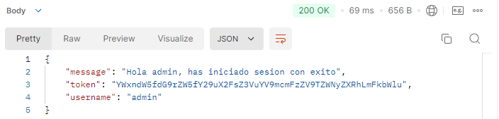
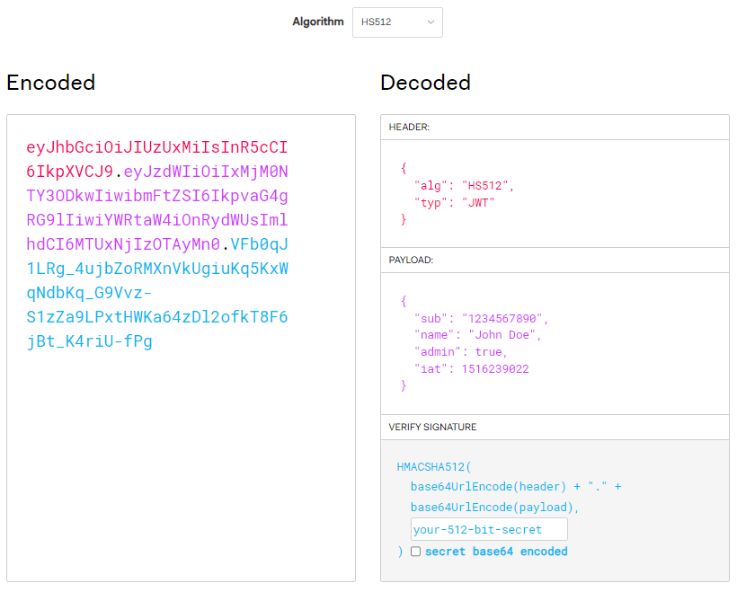
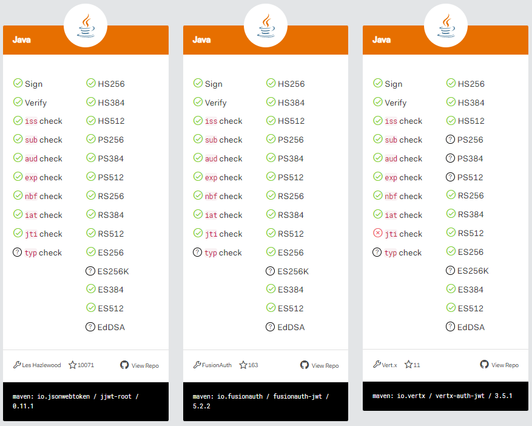
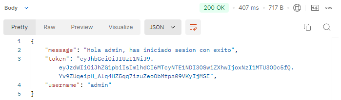
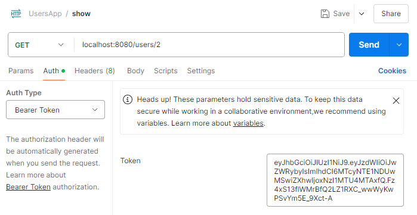
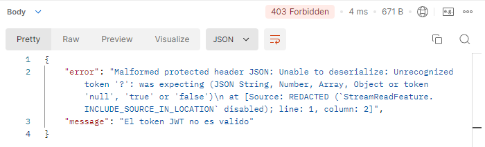
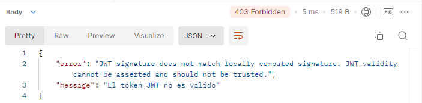
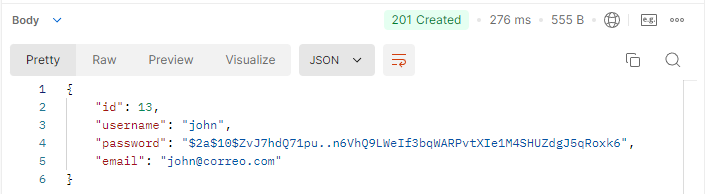

## Implementación de login con JPA

### 1. Implementación de `JpaUserDetailsService` para Login

- **Objetivo**: Implementar la funcionalidad de login utilizando JPA y comparar la contraseña del usuario encriptada.

- **Pasos a seguir**:
  
  1. **Método `loadUserByUsername`**:
     
     - Este método se encarga de cargar el usuario por su `username` desde la base de datos.
     - Se debe verificar que el `username` exista en la base de datos.
     - Se realiza la comparación de la contraseña encriptada mediante **Spring Security**. La contraseña enviada se encripta y se compara con la que está almacenada en la base de datos.
     - Si el usuario no se encuentra, se lanza la excepción `UsernameNotFoundException`.
  
  2. **Uso de `UserRepository`**:
     
     - Se crea un repositorio en `UserRepository` con el método `findByUsername`, que devuelve un `Optional<User>` para evitar errores si no se encuentra el usuario.
     - Alternativamente, se puede utilizar una consulta personalizada con `@Query` para buscar al usuario en la base de datos.
     
     ```java
     Optional<User> findByUsername(String username);
     ```
     
     O bien:
     
     ```java
     @Query("SELECT u FROM User u WHERE u.username = ?1")
     Optional<User> getUserByUsername(String username);
     ```
  
  3. **Inyección del Repositorio**:
     
     - Se inyecta `UserRepository` en `JpaUserDetailsService` con `@Autowired`.
  
  4. **Implementación de `loadUserByUsername`**:
     
     - Se busca el usuario por `username` con el método `findByUsername`.
     - Si el usuario no está presente, se lanza `UsernameNotFoundException`.
     - Se obtiene el usuario y se crean los **`GrantedAuthority`** para asignar roles, en este caso, `ROLE_USER`.
     
     ```java
     return new User(user.getUsername(), user.getPassword(), authorities);
     ```
  
  5. **Password Matching**:
     
     - **Spring Security** se encarga de comparar la contraseña encriptada que llega del formulario con la que está almacenada en la base de datos. Si ambas coinciden, se permite el acceso.
  
  6. **Marcado como `@Transactional(readOnly = true)`**:
     
     - La transacción se marca como de solo lectura para evitar cambios no deseados en la base de datos cuando solo se consulta el usuario.

### 2. Código Final de `JpaUserDetailsService`

```java
@Service
public class JpaUserDetailsService implements UserDetailsService {

    @Autowired
    private UserRepository repository;

    @Override
    @Transactional(readOnly = true)
    public UserDetails loadUserByUsername(String username) throws UsernameNotFoundException {
        // Realiza una busqueda en repository para encontrar al usuario por su nombre
        // Y no un unico usuario como "admin"
        // Se utiliza una importación directa para evitar que colisione con el otro User (se encuentra en el return)
        Optional<com.andres.backend.usersapp.backendusersapp.models.entities.User> o = repository.findByUsername(username);

        if (!o.isPresent()) {
            throw new UsernameNotFoundException(String.format("Username %s no existe en el sistema", username));
        }

        // Se utiliza una importación directa para evitar que User coincida con el User de org.springframework.security.core.userdetails.User
        com.andres.backend.usersapp.backendusersapp.models.entities.User user = o.orElseThrow();

        List<GrantedAuthority> authorities = new ArrayList<>();
        authorities.add(new SimpleGrantedAuthority("ROLE_USER"));

        // Se establece el nombre de usuario y la constraseña en el objeto User
        return new User(user.getUsername(), user.getPassword(), true, true, true, true, authorities);
    }
}
```

### 3. Pruebas con Postman

- Se realiza una petición `POST` a `localhost:8080/login` con el nombre de usuario y la contraseña en el cuerpo de la solicitud.  

```json
{
    "username": "admin",
    "password": "12345"
}
```

- Si las credenciales son correctas, se devuelve un token JWT en el encabezado de la respuesta.



- Luego puedes realizar una petición de tipo POST a `localhost:8080/users` (no olvidar pasarle el token generado al iniciar sesion) para registrar un nuevo usuario y puedes iniciar sesion con ese nuevo usuario (en una API REST no puedes cerrar la sesión actual).

## Proceso de configuración de JWT en la API

Este proceso se centra en la configuración de JWT (JSON Web Token) para la autenticación en aplicaciones. Se tiene en cuenta los siguientes puntos:

1. **JWT Structure**: Un JWT tiene tres partes: Header (cabecera), Payload (datos), y Signature (firma). El header define el algoritmo de firma (por ejemplo, HS256). El payload contiene la información que se envía (como el nombre de usuario o el rol). La firma garantiza que el token no haya sido alterado.

2. **Encriptación y Algoritmos**: Los algoritmos más comunes son HC256 y HS512. HS256 es el más común, pero HS512 es más robusto. El algoritmo usado para firmar el token se define en el header. Puedes visitar la siguiente página para decodificar un token: https://jwt.io/
   
   

3. **No Información Sensible**: El payload no debe contener información sensible como contraseñas, números de tarjeta o bancarios. Se recomienda almacenar solo información que sea necesaria para el proceso de autenticación (como nombre de usuario y rol).

4. **Dependencias en Java**: Para trabajar con JWT en Java, se utiliza la librería `jjwt` de Auth0. Se debe agregar las dependencias necesarias en el archivo `pom.xml` para Maven, que incluyen `jjwt-api`, `jjwt-impl`, y `jjwt-jackson`. Puedes ir al siguiente enlace para obtener las dependencias: [JSON Web Token Libraries - jwt.io](https://jwt.io/libraries), busca la libreria con la mayor calificación. Accede al repositorio de GitHub para obtener la dependencia.
   
   
   
   ```xml
   <dependency>
       <groupId>io.jsonwebtoken</groupId>
       <artifactId>jjwt-api</artifactId>
       <version>0.12.6</version>
   </dependency>
   <dependency>
       <groupId>io.jsonwebtoken</groupId>
       <artifactId>jjwt-impl</artifactId>
       <version>0.12.6</version>
       <scope>runtime</scope>
   </dependency>
   <dependency>
       <groupId>io.jsonwebtoken</groupId>
       <artifactId>jjwt-jackson</artifactId>
       <version>0.12.6</version>
       <scope>runtime</scope>
   </dependency>
   ```

5. **Creación de Token**: Para crear un token, se utiliza una clave secreta que se define en el backend y se usa para firmar el JWT. El token se puede generar con el siguiente código:
   
   ```java
   SecretKey key = Jwts.SIG.HS256.key().build();
   String jws = Jwts.builder().subject("Joe").signWith(key).compact();
   ```

6. **Verificación de Token**: Para validar un token, se utiliza la misma clave secreta para verificar que la firma es válida. Si el token es válido, se puede extraer el payload y los datos del usuario.
   
   ```java
   Jwts.parser().verifyWith(key).build().parseSignedClaims(compactJws);
   ```

7. **Configuración en Spring Boot**: En este caso se configura una clave secreta (en este caso, utilizando `SecretKey` en lugar de un string plano) en una clase como `TokenJwtConfig` (la clase contiene las variables estaticas o constantes que se utilizan en la aplicación, como `SECRET_KEY`, `PREFIX_TOKEN` y `HEADER_AUTHORIZATION`). Este cambio mejora la seguridad al usar un objeto de clave secreta en lugar de una cadena de texto simple.
   
   Ejemplo de configuración:
   
   ```java
   public final static SecretKey SECRET_KEY = Jwts.SIG.HS256.key().build();
   ```

8. **Recomendaciones**: La clave secreta debe mantenerse segura y no debe ser compartida ni almacenada en lugares públicos. Además, se debe actualizar regularmente y no almacenar información sensible en el payload del JWT.

Este proceso te permite integrar JWT de manera segura en tu aplicación de Spring Boot para manejar la autenticación y autorización de manera eficiente.

## Generación y firma de token JWT

1. **Autenticación del Usuario**
   
   - Se recibe un objeto `User` desde el `request`, extrayendo `username` y `password`.
   - Se genera un `UsernamePasswordAuthenticationToken` y se autentica con `AuthenticationManager`.

2. **Generación del Token JWT**
   
   - Se usa `Jwts.builder()` para construir el token.
   - Se establece el `subject` con el `username` (`setSubject(username)`).
   - Se firma el token con la clave secreta `SECRET_KEY` (`signWith(SECRET_KEY)`).
   - Se define la fecha de emisión (`setIssuedAt(new Date())`).
   - Se define la fecha de expiración (`setExpiration(new Date(System.currentTimeMillis() + 3600000))`).
   - Se finaliza con `compact()` para generar el token.

3. **Respuesta y Envío del Token**
   
   - Se agrega el token en la cabecera `Authorization` (`HEADER_AUTHORIZATION`).
   - Se devuelve en el cuerpo de la respuesta junto con un mensaje de éxito.

4. **Seguridad y Mejores Prácticas**
   
   - La clave secreta `SECRET_KEY` debe ser segura y no visible públicamente.
   - No incluir información sensible en el token, solo datos esenciales como el `username`.
   - Se define un tiempo de expiración (1 hora en este caso) para mayor seguridad.

Este proceso garantiza que el usuario autenticado reciba un token válido y seguro para futuras solicitudes.

```java
public class JwtAuthenticationFilter extends UsernamePasswordAuthenticationFilter {

    private AuthenticationManager authenticationManager;

    public JwtAuthenticationFilter(AuthenticationManager authenticationManager) {
        this.authenticationManager = authenticationManager;
    }

    @Override
    public Authentication attemptAuthentication(HttpServletRequest request, HttpServletResponse response)
            throws AuthenticationException {
        User user = null;
        String username = null;
        String password = null;

        try {
            user = new ObjectMapper().readValue(request.getInputStream(), User.class);
            username = user.getUsername();
            password = user.getPassword();

            // logger.info("Username desde request InputStream (raw) " + username);
            // logger.info("Password desde request InputStream (raw) " + password);

        } catch (StreamReadException e) {
            e.printStackTrace();
        } catch (DatabindException e) {
            e.printStackTrace();
        } catch (IOException e) {
            e.printStackTrace();
        }

        UsernamePasswordAuthenticationToken authToken = new UsernamePasswordAuthenticationToken(username, password);

        return authenticationManager.authenticate(authToken);
    }

    @Override
    protected void successfulAuthentication(HttpServletRequest request, HttpServletResponse response, FilterChain chain,
            Authentication authResult) throws IOException, ServletException {
        String username = ((org.springframework.security.core.userdetails.User) authResult.getPrincipal())
                .getUsername();

        // Generación del token con Jwts
        String token = Jwts.builder()
                // Nombre del usuario
                .setSubject(username)
                // Firma del token
                .signWith(SECRET_KEY)
                // Fecha de creación
                .setIssuedAt(new Date())
                // Fecha de expiración del token con System.currentTimeMillis (tiempo en milisegundos)
                .setExpiration(
                        new Date(System.currentTimeMillis() + 3600000))
                .compact();

        // Agrega el token en la cabecera de la respuesta
        response.addHeader(HEADER_AUTHORIZATION, PREFIX_TOKEN + token);

        Map<String, Object> body = new HashMap<>();

        body.put("token", token);
        body.put("message", String.format("Hola %s, has iniciado sesion con exito", username));
        body.put("username", username);

        response.getWriter().write(new ObjectMapper().writeValueAsString(body));
        response.setStatus(200);
        response.setContentType("application/json");
    }
}
```

## Validar el token

1. **Validación de la Cabecera:**
   
   - Se obtiene el valor de `Authorization` del `request`.
   - Si es `null` o no empieza con `Bearer`, se permite continuar con la solicitud sin autenticación.
   - Si contiene el token, se extrae eliminando el prefijo `Bearer`.

2. **Validación del Token JWT:**
   
   - Se intenta procesar el token con `Jwts.parserBuilder().setSigningKey(SECRET_KEY).build().parseClaimsJws(token)`.
   - Si la firma del token es válida y no ha expirado, se obtienen los `claims`.
   - Se extrae el `username` desde `claims.getSubject()`.
   - Se intenta obtener `username2` con `claims.get("username")` (pero devuelve `null`).

3. **Autenticación del Usuario:**
   
   - Se crea una lista de roles (`SimpleGrantedAuthority` con `"ROLE_USER"` por defecto).
   - Se genera un `UsernamePasswordAuthenticationToken` con el `username`, `null` (para el password) y los `authorities`.
   - Se establece la autenticación en el `SecurityContextHolder`.
   - Se continúa con la cadena de filtros (`chain.doFilter`).

4. **Manejo de Excepciones:**
   
   - Si el token es inválido, está modificado o expiró, se captura `JwtException`.
   - Se envía una respuesta con código `403` y un `JSON` con el mensaje de error.

```java
public class JwtValidationFilter extends BasicAuthenticationFilter {

    public JwtValidationFilter(AuthenticationManager authenticationManager) {
        super(authenticationManager);
    }

    @Override
    protected void doFilterInternal(HttpServletRequest request, HttpServletResponse response, FilterChain chain)
            throws IOException, ServletException {

        String header = request.getHeader(HEADER_AUTHORIZATION);

        if (header == null || !header.startsWith(PREFIX_TOKEN)) {
            chain.doFilter(request, response);
            return;
        }

        String token = header.replace(PREFIX_TOKEN, "");

        // No se utiliza el sistema Base 64, en su lugar se utiliza JWT

        // byte[] tokenDecodeBytes = Base64.getDecoder().decode(token);
        // String tokenDecode = new String(tokenDecodeBytes);
        // String[] tokenArr = tokenDecode.split("\\.");
        // String secret = tokenArr[0];
        // String username = tokenArr[1];

        // Utiliza un bloque try - catch en lugar de un bloque if - else
        try {
            // Se define un claims
            // Valida el token con la misma que fue creada y se concatena un build y parseClaimsJws 
            Claims claims = Jwts.parser().setSigningKey(SECRET_KEY).build().parseClaimsJws(token).getBody();

            // Obtiene el nombre del usuario que se encuentra dentro del token
            String username = claims.getSubject();
            // Otra forma
            Object username2 = claims.get("username");

            // Imprime el username
            System.out.println(username);
            System.out.println(username2);

            // Traslada aqui todo el contenido que habia en el bloque if
            List<GrantedAuthority> authorities = new ArrayList<>();

            authorities.add(new SimpleGrantedAuthority("ROLE_USER"));

            UsernamePasswordAuthenticationToken authentication = new UsernamePasswordAuthenticationToken(username, null,
                    authorities);

            SecurityContextHolder.getContext().setAuthentication(authentication);
            chain.doFilter(request, response);

        } catch (JwtException e) {
            // Contenido similar al bloque else, se muestra cuando lanza la excepción JwtException
            Map<String, String> body = new HashMap<>();

            // Dentro del body se coloca el error y el mensaje
            body.put("error", e.getMessage());
            body.put("message", "El token JWT no es valido");

            response.getWriter().write(new ObjectMapper().writeValueAsString(body));
            response.setStatus(403);
            response.setContentType("applicaction/json");
        }
    }

}
```

## Probar el token JWT en Postman

### Iniciar sesión y obtener un token JWT

- Realiza una petición **POST** a `localhost:8080/login` con las credenciales:
  
  ```json
  {
      "username": "admin",
      "password": "12345"
  }
  ```

- Se recibe un **token JWT** con tres partes: **header, payload y signature**.

- El token tiene una duración de **1 hora** y cambia en cada autenticación.



### Obtener usuario por ID (Protegido)

- Hacer una petición **GET** a `localhost:8080/users/2`.
- En la pestaña **Auth**, seleccionar **Bearer Token** e introducir el token generado.
- Si el token es válido, se obtiene el usuario.



### Pruebas de manipulación del token

- **Eliminar un carácter del token** → Error: `malformed protected header JSON`.



- **Modificar la firma** → Error: `JWT signature does not match locally computed signature`.
- **Modificar el payload** → Mismo error, ya que afecta la firma.



### Crear un nuevo usuario (Protegido)

- Puedes utilizar el mismo token que fue creado anteriormente o volver a iniciar sesión y obtener un nuevo token.

- Hacer una petición **POST** a `localhost:8080/users` con un nuevo usuario:
  
  ```json
  {
      "username": "john",
      "password": "john",
      "email": "john@correo.com"
  }
  ```
  
  

- Si el usuario o email ya existen, devuelve `403 Forbidden`.

### Importancia del Token y Reinicio del Servidor

- Si el backend se reinicia, los tokens previos dejan de ser válidos.
- Se debe iniciar sesión nuevamente para obtener un nuevo token JWT.
- Si se usa un token antiguo después de reiniciar el servidor, se obtiene el error:
  `"JWT signature does not match locally computed signature"`.

## Implementación de roles

### **Resumen de la Implementación de Roles en la Aplicación con JWT y Spring Boot**

1. **Creación de la entidad `Role`**
   
   - Se creó la clase `Role` anotada con `@Entity` y `@Table(name = "roles")`.
   - Tiene un `id` autogenerado (`@GeneratedValue(strategy = GenerationType.IDENTITY)`).
   - Contiene un campo `name` que representa el nombre del rol (ejemplo: `"ROLE_USER"`, `"ROLE_ADMIN"`).
   - Se generaron sus **getters y setters**.
   
   ```java
   @Entity
   @Table(name = "roles")
   public class Role {
   
       @Id
       @GeneratedValue(strategy = GenerationType.IDENTITY)
       private Long id;
   
       private String name;
   
       // Generar getters and setters
       public Long getId() {
           return id;
       }
   
       public void setId(Long id) {
           this.id = id;
       }
   
       public String getName() {
           return name;
       }
   
       public void setName(String name) {
           this.name = name;
       }
   
   }
   ```

2. **Relación entre `User` y `Role`**
   
   - En la clase `User`, se agregó una lista de roles (`List<Role> roles`).
   - Se anotó con `@ManyToMany`, indicando que un usuario puede tener varios roles y un rol puede estar en varios usuarios.
   - Se generaron los **getters y setters** para la lista de roles.
   
   ```java
   @Entity
   @Table(name = "users")
   public class User {
   
       @Id
       @GeneratedValue(strategy = GenerationType.IDENTITY)
       private Long id;
   
       @NotBlank
       @Size(min = 4, max = 8)
       @Column(unique = true)
       private String username;
   
       @NotBlank
       private String password;
   
       @Email
       @NotEmpty
       @Column(unique = true)
       private String email;
   
       // Relación de muchos a muchos con la entidad Role
       @ManyToMany
       private List<Role> roles;
   
       // Generar getters and setters
   }
   ```

3. **Implementación de la Tabla Intermedia `users_roles`**
   
   - Se requiere una tabla intermedia para gestionar la relación entre usuarios y roles.
   - Se utilizará un script SQL para definirla, asegurando que los pares `(user_id, role_id)` sean **únicos**.

4. **Integración con JWT**
   
   - En `JwtValidationFilter`, se obtiene el usuario con `getSubject()`.
   - Actualmente, los roles no están incluidos en el token, por lo que al validar el JWT solo se obtiene el nombre de usuario.
   - Para mejorar esto, en `JwtAuthenticationFilter`, se debe agregar una **lista de roles** en los claims del token al momento de su generación.

5. **Restricciones de Acceso por Rol**
   
   - Se planea restringir las acciones según los roles:
     - Un usuario con `ROLE_USER` solo podrá **ver usuarios**.
     - Un usuario con `ROLE_ADMIN` podrá **crear, modificar y eliminar usuarios**.

6. **Validaciones y Seguridad**
   
   - Se probará en **Postman** para verificar que los tokens con roles incorrectos o modificados sean rechazados.
   - Si el token es modificado, la firma del backend lo invalidará automáticamente.
   - Al reiniciar el servidor, los tokens antiguos se vuelven inválidos y los usuarios deben volver a iniciar sesión.

```java
@Entity
@Table(name = "users")
public class User {

    @Id
    @GeneratedValue(strategy = GenerationType.IDENTITY)
    private Long id;

    @NotBlank
    @Size(min = 4, max = 8)
    @Column(unique = true)
    private String username;

    @NotBlank
    private String password;

    @Email
    @NotEmpty
    @Column(unique = true)
    private String email;

    @ManyToMany
    private List<Role> roles;

    // Generar getters and setters
    public Long getId() {
        return id;
    }

    public void setId(Long id) {
        this.id = id;
    }

    public String getUsername() {
        return username;
    }

    public void setUsername(String username) {
        this.username = username;
    }

    public String getPassword() {
        return password;
    }

    public void setPassword(String password) {
        this.password = password;
    }

    public String getEmail() {
        return email;
    }

    public void setEmail(String email) {
        this.email = email;
    }

    public List<Role> getRoles() {
        return roles;
    }

    public void setRoles(List<Role> roles) {
        this.roles = roles;
    }
}
```
